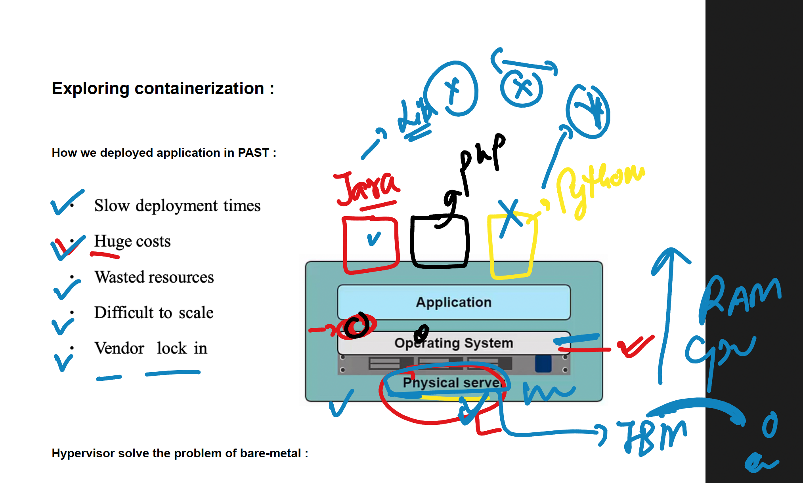
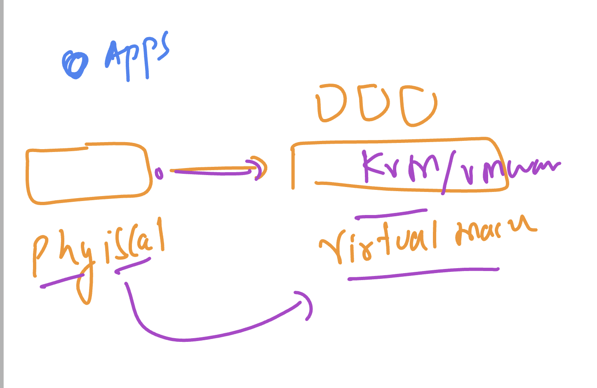
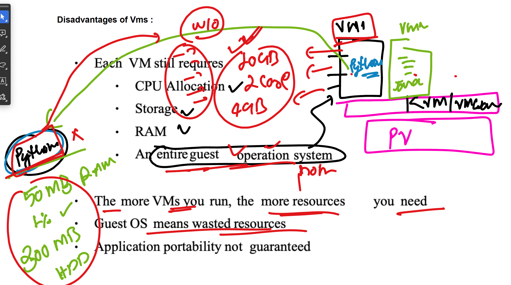
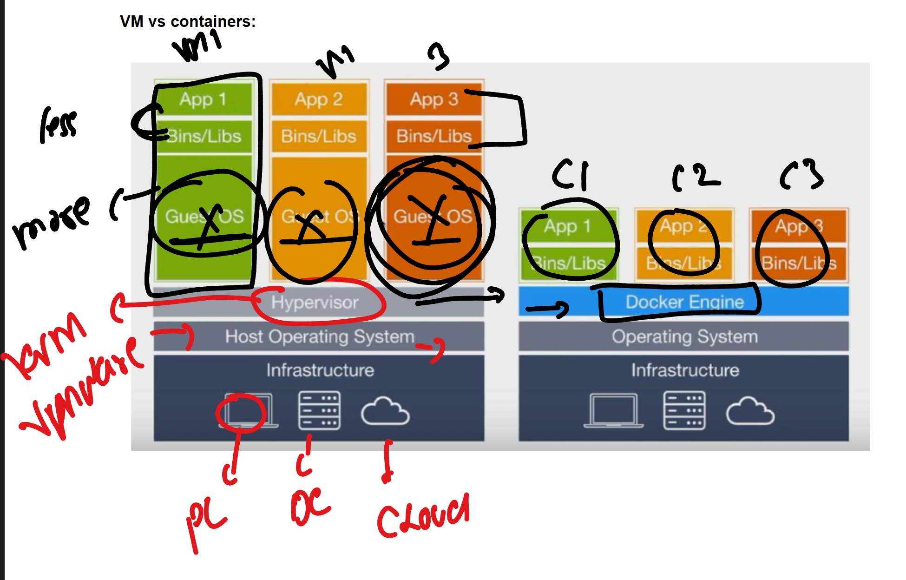
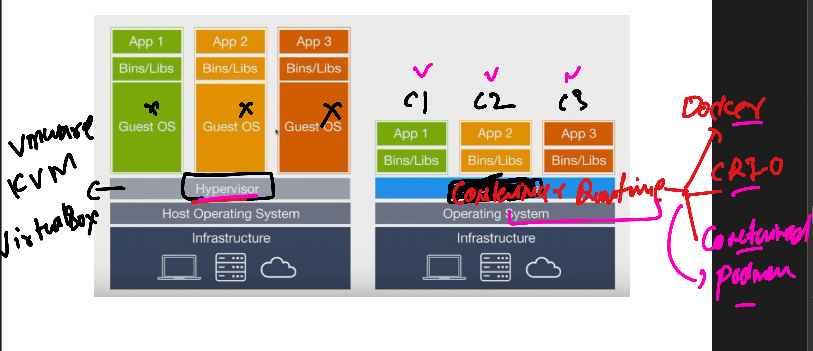
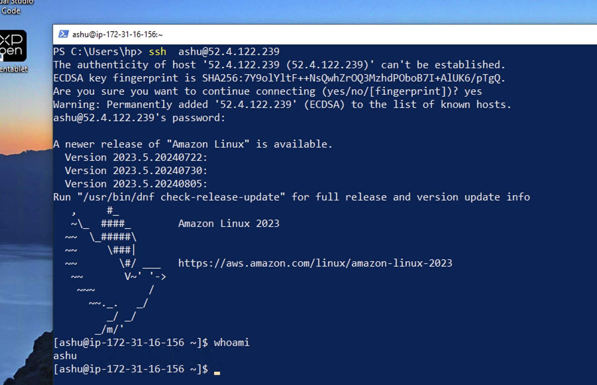

# running multiple apps in bare-metal or physical server

## moving physical to virtual 

## Understanding problem of VM for testing / deploying app

## vm vs containers 

## container runtimes for managing and creating container based app

### containers and kernel support 

# How to access jump server using ssh from windows machine 

