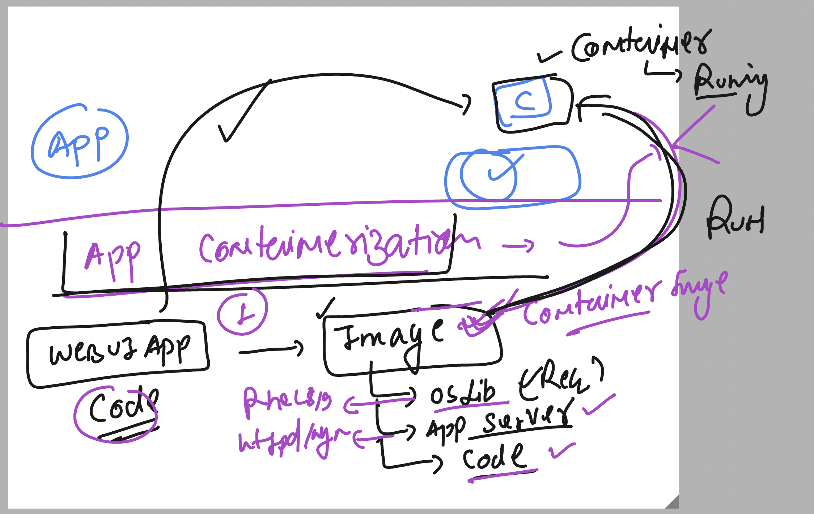
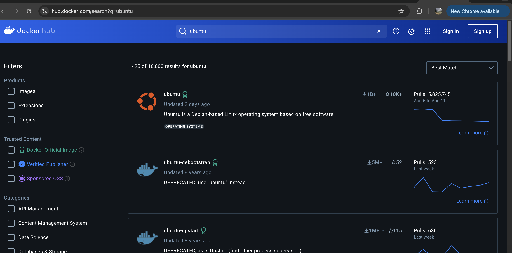
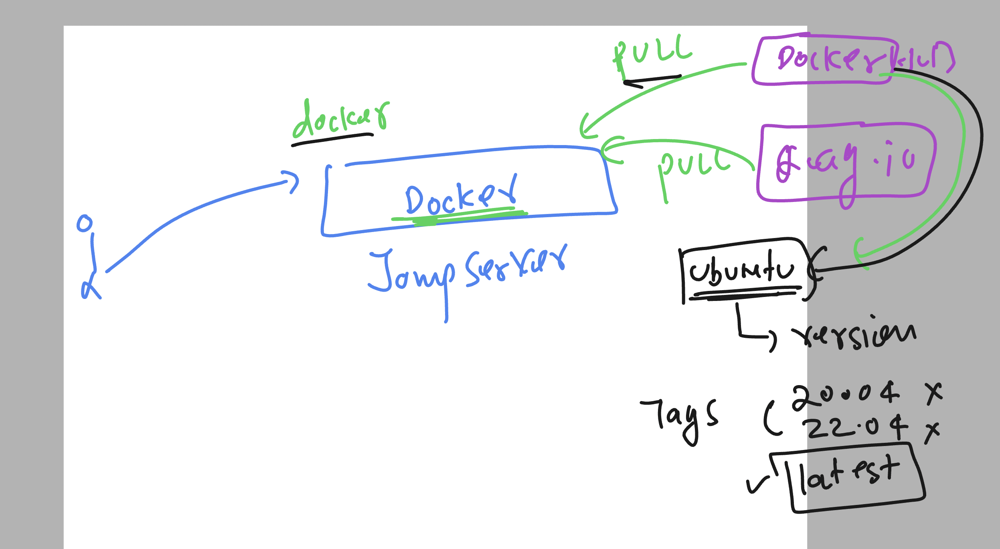
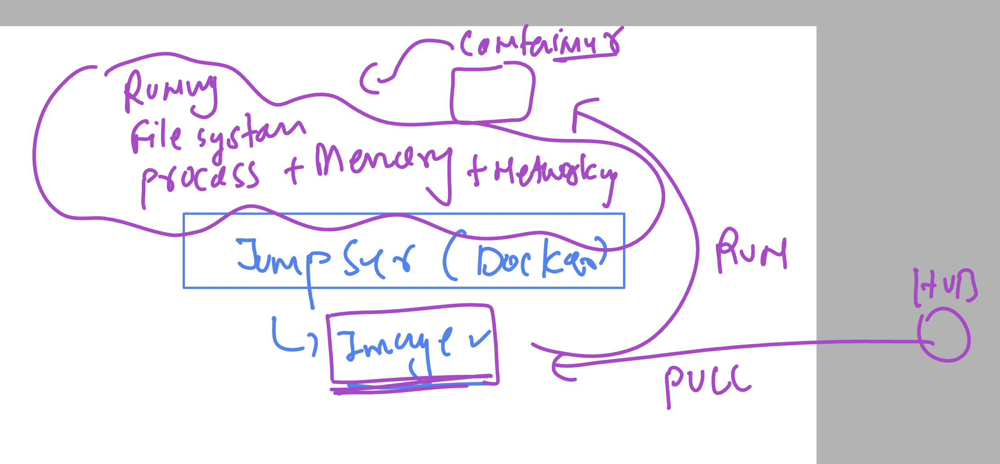
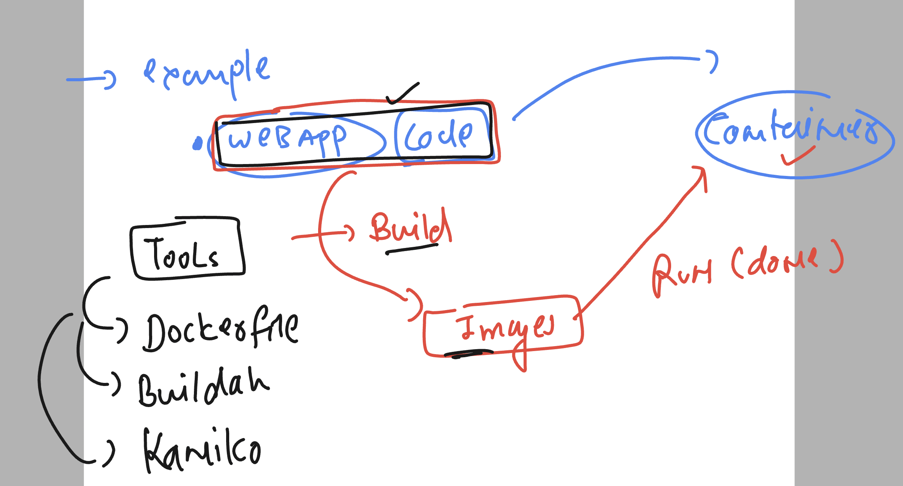

# running multiple apps in bare-metal or physical server


## moving physical to virtual 


## Understanding problem of VM for testing / deploying app


## vm vs containers 


## container runtimes for managing and creating container based app


### containers and kernel support 


# How to access jump server using ssh from windows machine 


## for container minimum linux kernel version required is

- **-kernel-** 
```
3.10
```

### checking docker system in linux server 

```

[ashu@ip-172-31-16-156 ~]$ systemctl  status docker
● docker.service - Docker Application Container Engine
     Loaded: loaded (/usr/lib/systemd/system/docker.service; enabled; preset: disabled)
     Active: active (running) since Mon 2024-08-19 04:48:30 UTC; 6h ago
TriggeredBy: ● docker.socket
       Docs: https://docs.docker.com
   Main PID: 2444 (dockerd)
      Tasks: 9
     Memory: 112.4M
```

### checking docker version 

```
[ashu@ip-172-31-16-156 ~]$ docker  version
Client:
 Version:           25.0.3
 API version:       1.44
 Go version:        go1.20.12
 Git commit:        4debf41
 Built:             Mon Feb 12 00:00:00 2024
 OS/Arch:           linux/amd64
 Context:           default

Server:
 Engine:
  Version:          25.0.3
  API version:      1.44 (minimum version 1.24)
  Go version:       go1.20.12
  Git commit:       f417435
  Built:            Mon Feb 12 00:00:00 2024
  OS/Arch:          linux/amd64
  Experimental:     false
 containerd:
  Version:          1.7.11
  GitCommit:        64b8a811b07ba6288238eefc14d898ee0b5b99ba
 runc:
  Version:          1.1.11
  GitCommit:        4bccb38cc9cf198d52bebf2b3a90cd14e7af8c06
 docker-init:
  Version:          0.19.0
  GitCommit:        de40ad0
```

## we want to run any app to containers 

## app containerization process



## Places from where you can download base container images



### pulling ubuntu image from docker hub 

```
[ashu@ip-172-31-16-156 ~]$ docker pull  ubuntu
Using default tag: latest
latest: Pulling from library/ubuntu
31e907dcc94a: Pull complete
Digest: sha256:8a37d68f4f73ebf3d4efafbcf66379bf3728902a8038616808f04e34a9ab63ee
Status: Downloaded newer image for ubuntu:latest
docker.io/library/ubuntu:latest

[ashu@ip-172-31-16-156 ~]$
[ashu@ip-172-31-16-156 ~]$ docker   images
REPOSITORY   TAG       IMAGE ID       CREATED       SIZE
ubuntu       latest    edbfe74c41f8   2 weeks ago   78.1MB
[ashu@ip-172-31-16-156 ~]$

```

### by default docker pull will use latest tag image 



### pulling custom tag images 

```
[ashu@ip-172-31-16-156 ~]$ docker pull  ubuntu:24.04
24.04: Pulling from library/ubuntu
Digest: sha256:8a37d68f4f73ebf3d4efafbcf66379bf3728902a8038616808f04e34a9ab63ee
Status: Downloaded newer image for ubuntu:24.04
docker.io/library/ubuntu:24.04


[ashu@ip-172-31-16-156 ~]$ docker   images
REPOSITORY   TAG       IMAGE ID       CREATED       SIZE
ubuntu       24.04     edbfe74c41f8   2 weeks ago   78.1MB
ubuntu       latest    edbfe74c41f8   2 weeks ago   78.1MB
[ashu@ip-172-31-16-156 ~]$

```

### lets try creating containers 



### Creating container from the image 

```
[ashu@ip-172-31-16-156 ~]$ docker run  --name ashuc1  -d     alpine   ping localhost
160df83f66ccbabc58e9885112adef9c104d4470adccaceedb04aca55975bb66
```

### listing running contaienrs 

```
[ashu@ip-172-31-16-156 ~]$ docker  ps
CONTAINER ID   IMAGE     COMMAND            CREATED          STATUS          PORTS     NAMES
160df83f66cc   alpine    "ping localhost"   58 seconds ago   Up 57 seconds             ashuc1
```

### stoping running containers 

```
[ashu@ip-172-31-16-156 ~]$ docker  stop ashuc1
ashuc1
[ashu@ip-172-31-16-156 ~]$ docker  ps
CONTAINER ID   IMAGE     COMMAND            CREATED         STATUS         PORTS     NAMES
4b59ba02d973   alpine    "ping localhost"   2 minutes ago   Up 2 minutes             siddhant
ed922df2ab3b   alpine    "ping localhost"   3 minutes ago   Up 3 minutes             asif7
440ce62ba27f   alpine    "ping localhost"   6 minutes ago   Up 6 minutes             sachinalp1
[ashu@ip-172-31-16-156 ~]$
```

### listing all contaienr and starting it back 

```
[ashu@ip-172-31-16-156 ~]$ docker  ps -a
CONTAINER ID   IMAGE     COMMAND            CREATED          STATUS                        PORTS     NAMES
4b59ba02d973   alpine    "ping localhost"   3 minutes ago    Exited (137) 33 seconds ago             siddhant
ed922df2ab3b   alpine    "ping localhost"   4 minutes ago    Up 4 minutes                            asif7
74707174ecd1   ubuntu    "/bin/bash"        6 minutes ago    Exited (0) 6 minutes ago                boring_wilbur
440ce62ba27f   alpine    "ping localhost"   6 minutes ago    Up 6 minutes                            sachinalp1
160df83f66cc   alpine    "ping localhost"   8 minutes ago    Exited (137) 56 seconds ago             ashuc1
58b10261578d   alpine    "/bin/sh"          8 minutes ago    Exited (0) 8 minutes ago                awesome_heyrovsky
3e94b4934dc5   alpine    "/bin/sh"          12 minutes ago   Exited (0) 12 minutes ago               laughing_yonath


[ashu@ip-172-31-16-156 ~]$ docker  start  ashuc1
ashuc1


[ashu@ip-172-31-16-156 ~]$ docker  ps
CONTAINER ID   IMAGE     COMMAND            CREATED         STATUS         PORTS     NAMES
ed922df2ab3b   alpine    "ping localhost"   5 minutes ago   Up 5 minutes             asif7
160df83f66cc   alpine    "ping localhost"   9 minutes ago   Up 1 second              ashuc1
```


### Understanding container image building process



### download sample git clone 

```
[ashu@ip-172-31-16-156 ~]$ git clone https://github.com/schoolofdevops/html-sample-app.git
Cloning into 'html-sample-app'...
remote: Enumerating objects: 74, done.
remote: Counting objects: 100% (3/3), done.
remote: Compressing objects: 100% (3/3), done.
remote: Total 74 (delta 0), reused 0 (delta 0), pack-reused 71 (from 1)
Receiving objects: 100% (74/74), 1.38 MiB | 37.21 MiB/s, done.
Resolving deltas: 100% (5/5), done.

[ashu@ip-172-31-16-156 ~]$
[ashu@ip-172-31-16-156 ~]$
[ashu@ip-172-31-16-156 ~]$ ls
html-sample-app
[ashu@ip-172-31-16-156 ~]$ ls   html-sample-app/
LICENSE.txt  README.txt  assets  elements.html  generic.html  html5up-phantom.zip  images  index.html
[ashu@ip-172-31-16-156 ~]$

```

### building image using dockerfile 

```
[ashu@ip-172-31-16-156 html-sample-app]$ ls
Dockerfile  LICENSE.txt  README.txt  assets  elements.html  generic.html  html5up-phantom.zip  images  index.html
[ashu@ip-172-31-16-156 html-sample-app]$
[ashu@ip-172-31-16-156 html-sample-app]$
[ashu@ip-172-31-16-156 html-sample-app]$ docker  build  -t  ashuwebapp:appv1  .
[+] Building 10.9s (5/7)                                                                                                                     docker:default
[+] Building 46.2s (5/7)                                                                                                                     docker:default
 => [internal] load build definition from Dockerfile                                                                                                   0.0s
 => => transferring dockerfile: 598B                                                                                                                   0.0s
 => [internal] load metadata for docker.io/library/oraclelinux:8.7                                                                                     0.5s
 => [internal] load .dockerignore                                                                                                                      0.0s
 => => transferring context: 2B                                                                                                                        0.0s
 => [1/3] FROM docker.io/library/oraclelinux:8.7@sha256:74a283a310b2853af75555a5be11304f1502b042daf8269534d8b6b0125d3a18                               6.6s
 => => resolve docker.io/library/oraclelinux:8.7@sha256:74a283a310b2853af75555a5be11304f1502b042daf8269534d8b6b0125d3a18                               0.0s
 => => sha256:74a283a310b2853af75555a5be11304f1502b042daf8269534d8b6b0125d3a18 547B / 547B                                                             0.0s
 => => sha256:9384443b9af48c70004e27819f434529e88c8072de46835e1e064a10559088dd 529B / 529B                                                             0.0s
 => => sha256:64a9493ed8405e5a1b9515929173bc342fed8a9f35451e09b815c0be029afc8a 1.48kB / 1.48kB                                                         0.0s
 => => sha256:06d6f22c2168ed40d437d9165a6c726f0bcaa2fd76ab943ed29f9ee4216e11fb 88.44MB / 88.44MB                                                       1.6s
 => => extracting sha256:06d6f22c2168ed40d437d9165a6c726f0bcaa2fd76ab943ed29f9ee4216e11fb                                                              4.4s
 => [internal] load build context                                                                                                                      0.1s
 => => transferring context: 3.56MB                                                                                                                    0.1s
 => [2/3] RUN dnf install httpd -y                                                                                                                    39.0s
 => => # Oracle Linux 8 BaseOS Latest (x86_64)            65 MB/s |  79 MB     00:01
 => => # Oracle Linux 8 Application Stream (x86_64)       66 MB/s |  62 MB     00:00
 => => # Last metadata expiration check: 0:00:17 ago on Mon Aug 19 12:14:53 2024.
```

