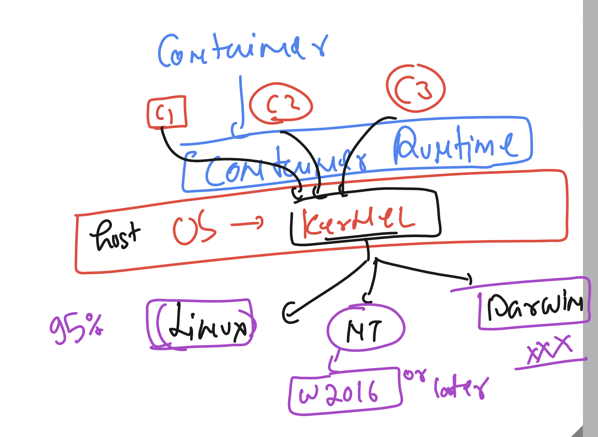

# running multiple apps in bare-metal or physical server


## moving physical to virtual 


## Understanding problem of VM for testing / deploying app


## vm vs containers 


## container runtimes for managing and creating container based app


### containers and kernel support 



# How to access jump server using ssh from windows machine 


## for container minimum linux kernel version required is

- **-kernel-** 
```
3.10
```

### checking docker system in linux server 

```

[ashu@ip-172-31-16-156 ~]$ systemctl  status docker
● docker.service - Docker Application Container Engine
     Loaded: loaded (/usr/lib/systemd/system/docker.service; enabled; preset: disabled)
     Active: active (running) since Mon 2024-08-19 04:48:30 UTC; 6h ago
TriggeredBy: ● docker.socket
       Docs: https://docs.docker.com
   Main PID: 2444 (dockerd)
      Tasks: 9
     Memory: 112.4M
```

### checking docker version 

```
[ashu@ip-172-31-16-156 ~]$ docker  version
Client:
 Version:           25.0.3
 API version:       1.44
 Go version:        go1.20.12
 Git commit:        4debf41
 Built:             Mon Feb 12 00:00:00 2024
 OS/Arch:           linux/amd64
 Context:           default

Server:
 Engine:
  Version:          25.0.3
  API version:      1.44 (minimum version 1.24)
  Go version:       go1.20.12
  Git commit:       f417435
  Built:            Mon Feb 12 00:00:00 2024
  OS/Arch:          linux/amd64
  Experimental:     false
 containerd:
  Version:          1.7.11
  GitCommit:        64b8a811b07ba6288238eefc14d898ee0b5b99ba
 runc:
  Version:          1.1.11
  GitCommit:        4bccb38cc9cf198d52bebf2b3a90cd14e7af8c06
 docker-init:
  Version:          0.19.0
  GitCommit:        de40ad0
```

## we want to run any app to containers 

## app containerization process


## Places from where you can download base container images


### pulling ubuntu image from docker hub 

```
[ashu@ip-172-31-16-156 ~]$ docker pull  ubuntu
Using default tag: latest
latest: Pulling from library/ubuntu
31e907dcc94a: Pull complete
Digest: sha256:8a37d68f4f73ebf3d4efafbcf66379bf3728902a8038616808f04e34a9ab63ee
Status: Downloaded newer image for ubuntu:latest
docker.io/library/ubuntu:latest

[ashu@ip-172-31-16-156 ~]$
[ashu@ip-172-31-16-156 ~]$ docker   images
REPOSITORY   TAG       IMAGE ID       CREATED       SIZE
ubuntu       latest    edbfe74c41f8   2 weeks ago   78.1MB
[ashu@ip-172-31-16-156 ~]$

```

### by default docker pull will use latest tag image 


### pulling custom tag images 

```
[ashu@ip-172-31-16-156 ~]$ docker pull  ubuntu:24.04
24.04: Pulling from library/ubuntu
Digest: sha256:8a37d68f4f73ebf3d4efafbcf66379bf3728902a8038616808f04e34a9ab63ee
Status: Downloaded newer image for ubuntu:24.04
docker.io/library/ubuntu:24.04


[ashu@ip-172-31-16-156 ~]$ docker   images
REPOSITORY   TAG       IMAGE ID       CREATED       SIZE
ubuntu       24.04     edbfe74c41f8   2 weeks ago   78.1MB
ubuntu       latest    edbfe74c41f8   2 weeks ago   78.1MB
[ashu@ip-172-31-16-156 ~]$

```

