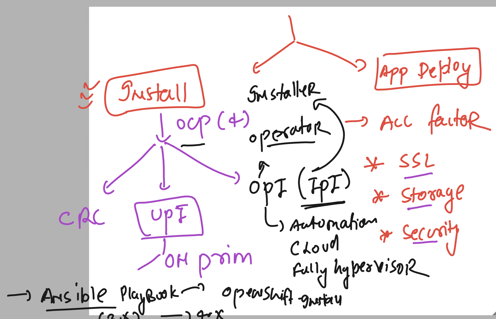

# ocp4_tcs_19thaug2024

### OPenshift overall 2 sides of understanding 



### openshift app deployment required check list 


### cleaning up project resources 

```
[ashu@ip-172-31-16-156 ~]$ oc  whoami 
kube:admin
===>>
oc  get projects  | grep -i ashu
ashu-app-project                                                  Active
ashu-poc-web1                                                     Active
[ashu@ip-172-31-16-156 ~]$ oc  delete all --all -n ashu-app-project 
Warning: apps.openshift.io/v1 DeploymentConfig is deprecated in v4.14+, unavailable in v4.10000+
No resources found
[ashu@ip-172-31-16-156 ~]$ oc  delete all --all -n ashu-poc-web1 
Warning: apps.openshift.io/v1 DeploymentConfig is deprecated in v4.14+, unavailable in v4.10000+
No resources found

```

### login with non root user and creating a project 

```
oc  new-project   ashu-ocp-final 
Now using project "ashu-ocp-final" on server "https://api.tcs-cluster.ashutoshh.xyz:6443".

You can add applications to this project with the 'new-app' command. For example, try:

    oc new-app rails-postgresql-example

to build a new example application in Ruby. Or use kubectl to deploy a simple Kubernetes application:

    kubectl create deployment hello-node --image=registry.k8s.io/e2e-test-images/agnhost:2.43 -- /agnhost serve-hostname

[ashu@ip-172-31-16-156 ~]$ 
[ashu@ip-172-31-16-156 ~]$ oc project
Using project "ashu-ocp-final" on server "https://api.tcs-cluster.ashutoshh.xyz:6443".
[ashu@ip-172-31-16-156 ~]$ ls
html-sample-app  kubeconfig  ocp_manifests
[ashu@ip-172-31-16-156 ~]$ cd  ocp_manifests/
[ashu@ip-172-31-16-156 ocp_manifests]$ ls
ashuwebpod.yaml  autopod.json  autopod.yaml  day6_deploy.yaml  day6route.yaml  day6svc.yml  deploy1.yaml  private.yaml  regsecret.yaml  service.yaml  storage  users_manifest
[ashu@ip-172-31-16-156 ocp_manifests]$ mkdir  finalapp 
[ashu@ip-172-31-16-156 ocp_manifests]$ cd finalapp/
[ashu@ip-172-31-16-156 finalapp]$ ls
[ashu@ip-172-31-16-156 finalapp]$ 

```

## Deploying mysql db from private registry 

```
oc create deployment ashu-mysqldb  --image=tcsindia.azurecr.io/mysql:8.0  --port 3306 --dry-run=client -o yaml >mysql_deploy.yaml
```

### to pull image we need to create registry credentials 

```
 oc  create secret 
Create a secret with specified type.

 A docker-registry type secret is for accessing a container registry.

 A generic type secret indicate an Opaque secret type.

 A tls type secret holds TLS certificate and its associated key.

Available Commands:
  docker-registry   Create a secret for use with a Docker registry
  generic           Create a secret from a local file, directory, or literal value
  tls               Create a TLS secret

Usage:
  oc create secret (docker-registry | generic | tls) [options]

Use "oc create secret <command> --help" for more information about a given command.


====>

oc  create secret  docker-registry   ashu-img-secret  --docker-server  tcsindia.azurecr.io  --docker-username tcsindia --docker-password="gtm2Clq3uH"  --dry-run=client -o yaml >imgsecret.yaml 
 1018  la
 1019  ls
 1020  history 
[ashu@ip-172-31-16-156 finalapp]$ oc  create  -f imgsecret.yaml 
secret/ashu-img-secret created
[ashu@ip-172-31-16-156 finalapp]$ oc  get  secrets
NAME                       TYPE                             DATA   AGE
ashu-img-secret            kubernetes.io/dockerconfigjson   1      3s
builder-dockercfg-4mw98    kubernetes.io/dockercfg          1      12m
default-dockercfg-z4xj4    kubernetes.io/dockercfg          1      12m
deployer-dockercfg-8qjcv   kubernetes.io/dockercfg          1      12m
[ashu@ip-172-31-16-156 finalapp]$ 

```

### mysql yaml with img secret udpates

```
apiVersion: apps/v1
kind: Deployment
metadata:
  creationTimestamp: null
  labels:
    app: ashu-mysqldb
  name: ashu-mysqldb
spec:
  replicas: 1
  selector:
    matchLabels:
      app: ashu-mysqldb
  strategy: {}
  template:
    metadata:
      creationTimestamp: null
      labels:
        app: ashu-mysqldb
    spec:
      imagePullSecrets: # to pull image from container registry (private registry)
      - name: ashu-img-secret 
      containers:
      - image: tcsindia.azurecr.io/mysql:8.0
        name: mysql
        ports:
        - containerPort: 3306
        resources: {}
status: {}

```

### storing mysql root password in secret 

```
oc  create secret generic rootcred  --from-literal  sqlpass="Ocp@123456" --dry-run=client -o yaml >rootsecret.yml
[ashu@ip-172-31-16-156 finalapp]$ oc create -f rootsecret.yml 
secret/rootcred created

```
### update mysql manifest file 

```
apiVersion: apps/v1
kind: Deployment
metadata:
  creationTimestamp: null
  labels:
    app: ashu-mysqldb
  name: ashu-mysqldb
spec:
  replicas: 1
  selector:
    matchLabels:
      app: ashu-mysqldb
  strategy: {}
  template:
    metadata:
      creationTimestamp: null
      labels:
        app: ashu-mysqldb
    spec:
      imagePullSecrets: # to pull image from container registry (private registry)
      - name: ashu-img-secret 
      containers:
      - image: tcsindia.azurecr.io/mysql:8.0
        name: mysql
        ports:
        - containerPort: 3306
        env: 
        - name: MYSQL_ROOT_PASSWORD
          valueFrom:
            secretKeyRef:
              name: rootcred
              key: sqlpass 
        - name: MYSQL_DATABASE
          value: ashuwebdb
        resources: {}

```