### testing last build image by creating container 

## From docker image to container 

```
docker  run --name ashuwebc1  -d  ashuwebapp:appv1 
0aeb76d52e9379f31410819d33db81accc1234eb0a98f3b5082ab78e437c5047


[ashu@ip-172-31-16-156 ~]$ docker  ps
CONTAINER ID   IMAGE              COMMAND                 CREATED          STATUS          PORTS     NAMES
0aeb76d52e93   ashuwebapp:appv1   "httpd -D FOREGROUND"   4 seconds ago    Up 3 seconds              ashuwebc1

```

### checking resources of containers 

```
[ashu@ip-172-31-16-156 ~]$ docker  stats  ashuwebc1

CONTAINER ID   NAME        CPU %     MEM USAGE / LIMIT     MEM %     NET I/O     BLOCK I/O     PIDS
0aeb76d52e93   ashuwebc1   0.09%     17.16MiB / 7.744GiB   0.22%     936B / 0B   0B / 8.19kB   213


```

### port mapping in container networking 

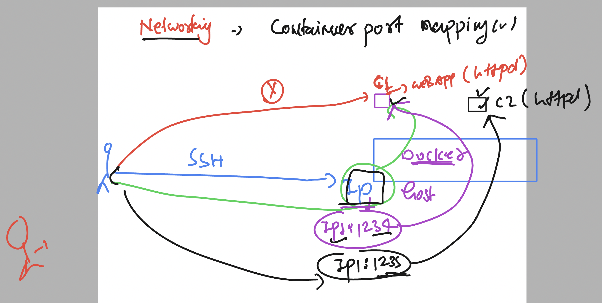

### creating container with port mapping 

```
ashu@ip-172-31-16-156 ~]$ docker  run -d --name ashuc11  -p  1234:80   ashuwebapp:appv1  
b118590e5f8a7b6b267cd5c04109e57f7838f4fb9cd950db3e3bbd8d5bab59a5


[ashu@ip-172-31-16-156 ~]$ docker  ps
CONTAINER ID   IMAGE              COMMAND                 CREATED         STATUS         PORTS                                   NAMES
b118590e5f8a   ashuwebapp:appv1   "httpd -D FOREGROUND"   3 seconds ago   Up 2 seconds   0.0.0.0:1234->80/tcp, :::1234->80/tcp   ashuc11
[ashu@ip-172-31-16-156 ~]$ 


```

### container port mapping 

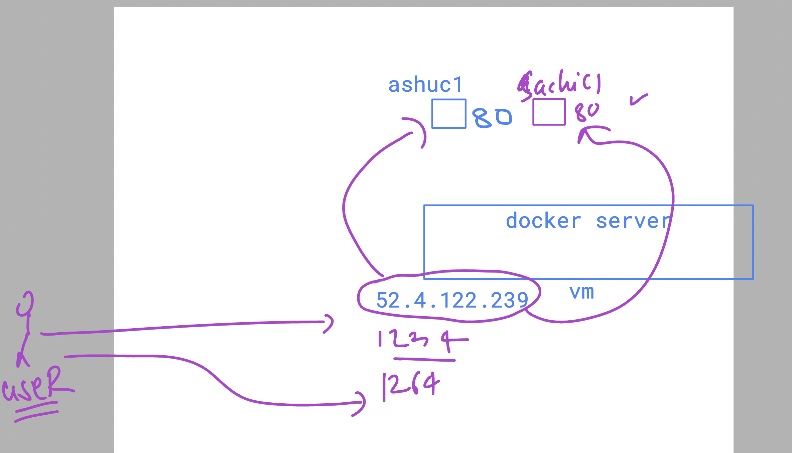

## Understanding use of docker hub 

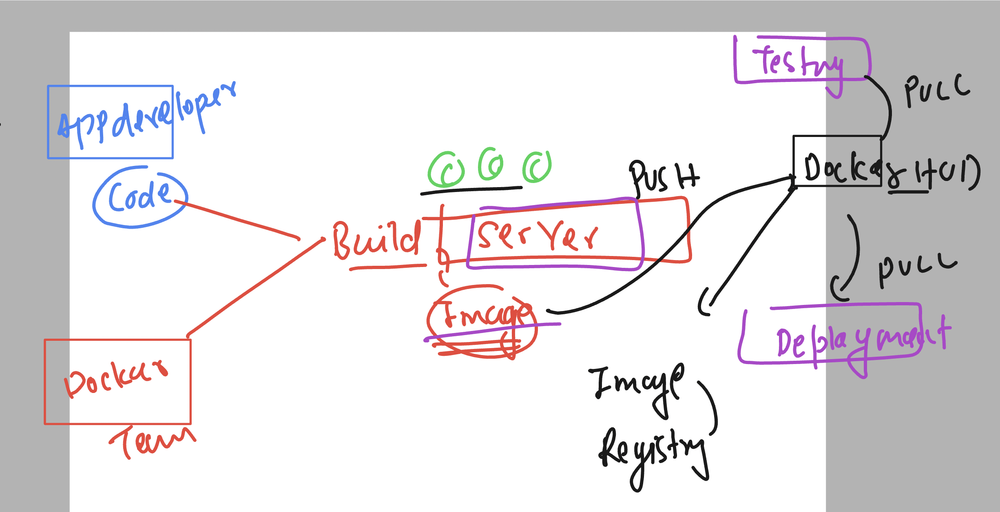

### pushing image to docker hub account 

```
[ashu@ip-172-31-16-156 ~]$ docker   tag  ashuwebapp:appv1     docker.io/dockerashu/ashutcs:webappv1
[ashu@ip-172-31-16-156 ~]$ 
[ashu@ip-172-31-16-156 ~]$ docker login  -u  dockerashu 
Password: 
WARNING! Your password will be stored unencrypted in /home/ashu/.docker/config.json.
Configure a credential helper to remove this warning. See
https://docs.docker.com/engine/reference/commandline/login/#credentials-store

Login Succeeded
[ashu@ip-172-31-16-156 ~]$ 
[ashu@ip-172-31-16-156 ~]$ 

[ashu@ip-172-31-16-156 ~]$ docker  push  docker.io/dockerashu/ashutcs:webappv1
The push refers to repository [docker.io/dockerashu/ashutcs]
6a79e9661aac: Pushed 
6bdd092574bb: Pushed 
e78cf5418e0f: Mounted from library/oraclelinux 
webappv1: digest: sha256:8868e08166e1c7a22d75674b1d2777216791867c2d7db4bf6c3c191b7c3ba244 size: 953
[ashu@ip-172-31-16-156 ~]$ 
[ashu@ip-172-31-16-156 ~]$ docker logout 
Removing login credentials for https://index.docker.io/v1/
[ashu@ip-172-31-16-156 ~]$ 
[ashu@ip-172-31-16-156 ~]$ 
[ashu@ip-172-31-16-156 ~]$ 

```

### From Monolith to Microservices 

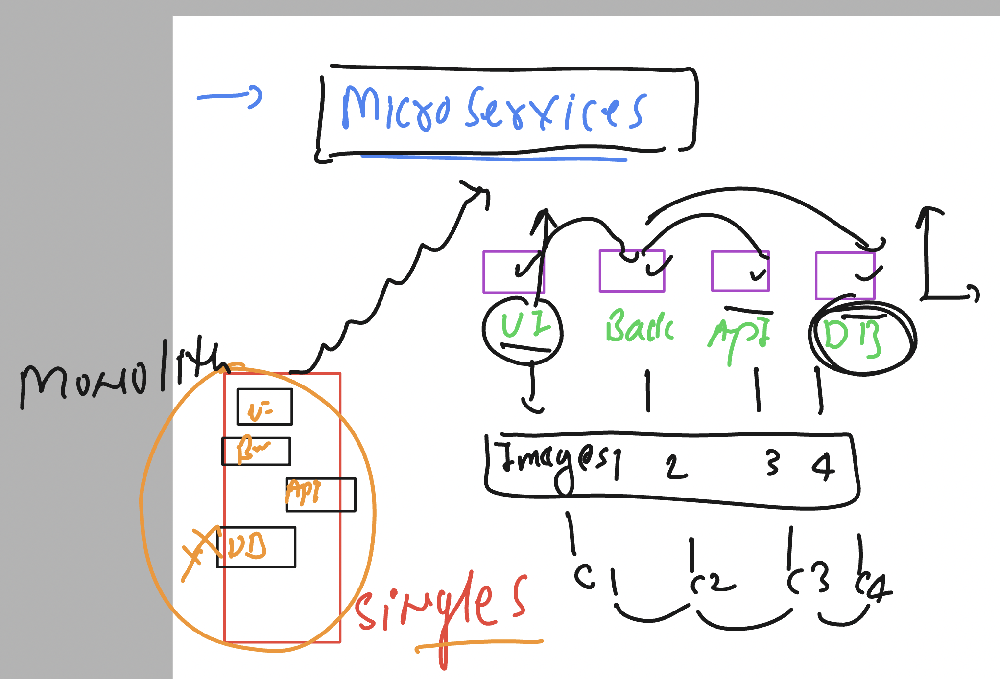

### having too much containers in multple machine gonna lead to new problem statement 

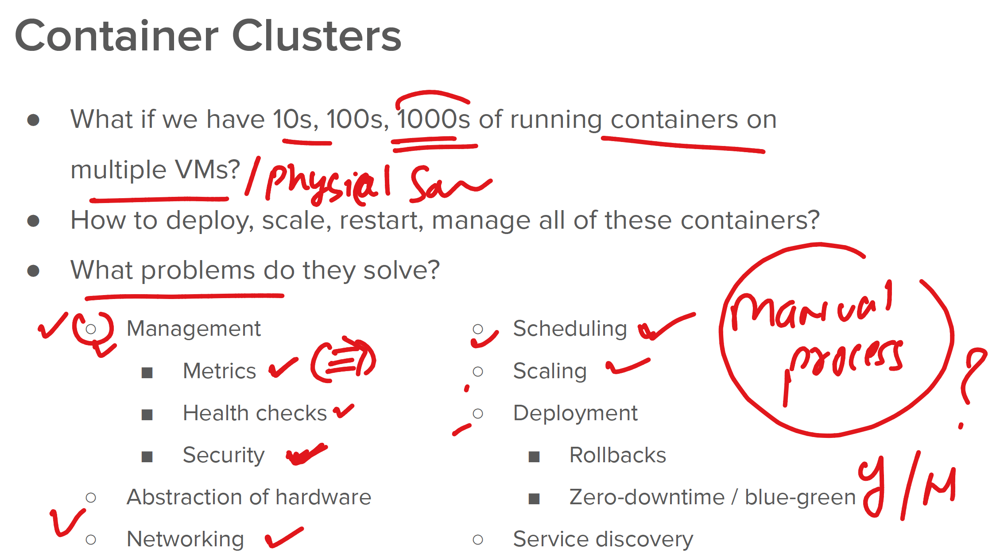

## Container orchestration problem solution by given tools and tech 

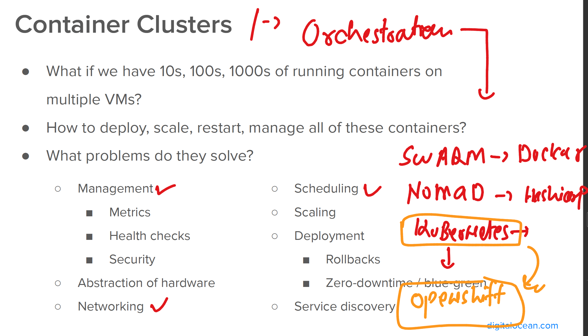

# K8s understanding 

### basic info 
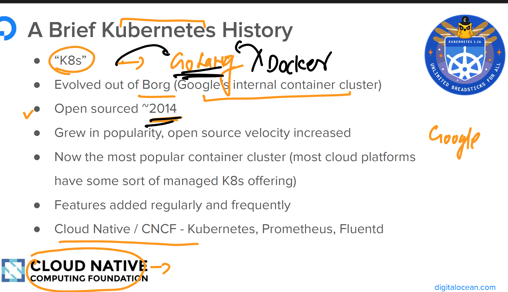

## High level architecture 

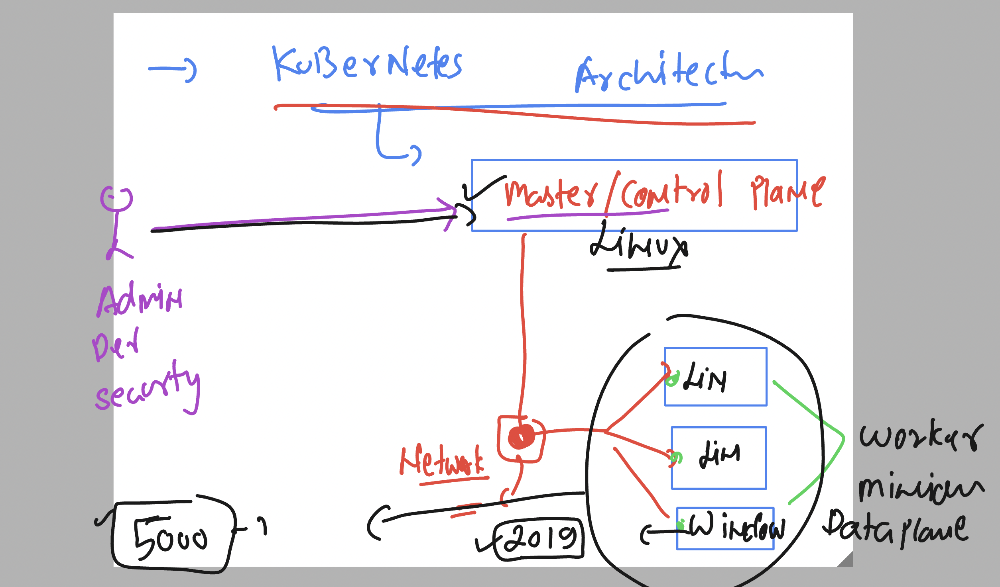

## Control plane apiServer 

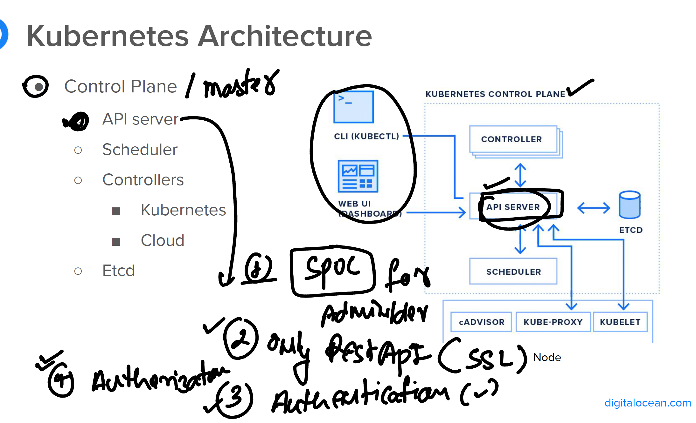

### schedular in openshift / k8s 

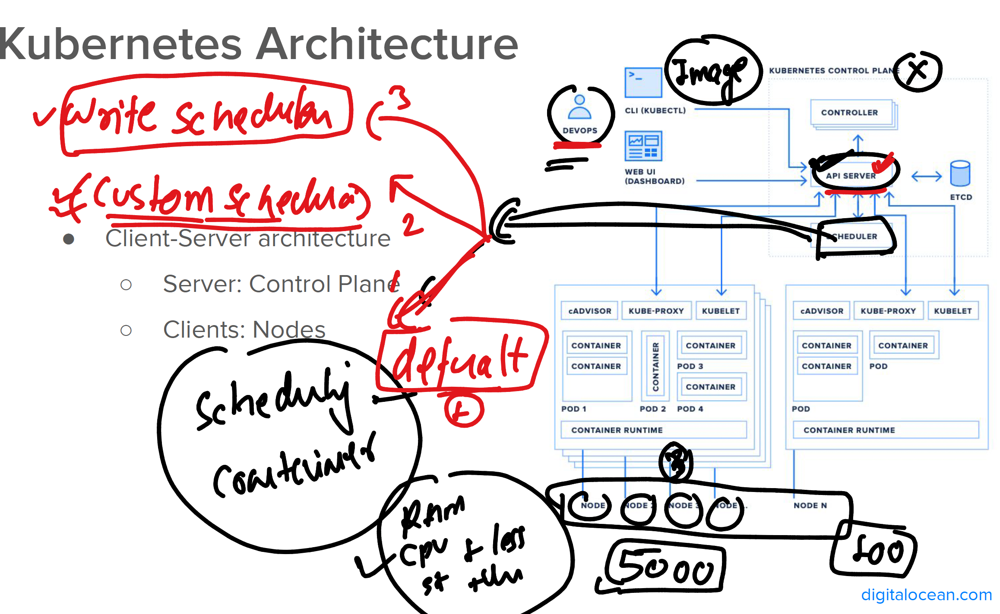

### etcd the persistent storage of k8s / ocp 

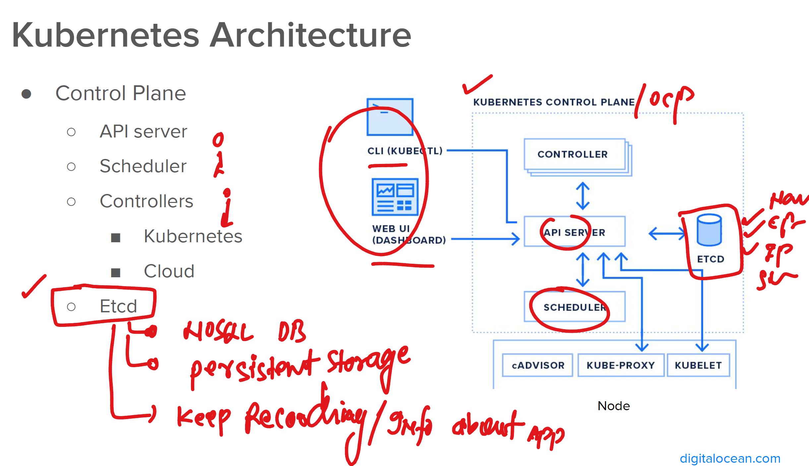

## Worker Node components 

### Cadvisor 

[click_here](https://github.com/google/cadvisor)

### COntainer runtimes 

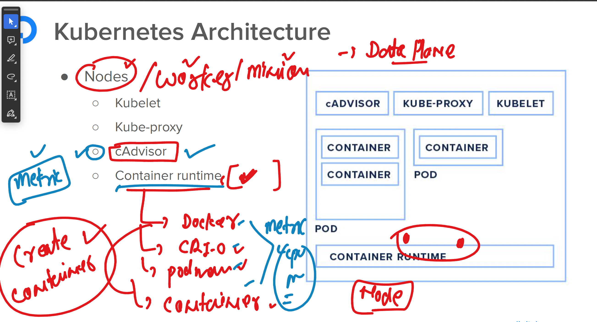


