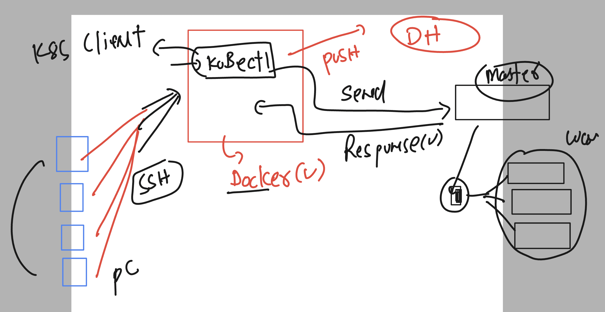

# ocp4_tcs_19thaug2024

## k8s revision 


### checking existing container image 

```
[ashu@ip-172-31-16-156 ~]$ who
sachinG  pts/0        2024-08-22 08:38 (103.221.250.71)
vivek    pts/1        2024-08-22 08:40 (171.48.84.72)
sachinD  pts/2        2024-08-22 08:45 (152.58.28.240)
ec2-user pts/3        2024-08-22 08:50 (106.215.50.153)
ec2-user pts/4        2024-08-22 08:50 (106.215.50.153)
[ashu@ip-172-31-16-156 ~]$ 
[ashu@ip-172-31-16-156 ~]$ docker  images  | grep ashu
dockerashu/ashutcs             webappv1   dcaa1198974f   2 days ago     538MB
ashuwebapp                     appv1      dcaa1198974f   2 days ago     538MB
[ashu@ip-172-31-16-156 ~]$ 


```

### Understanding lab infra 



### checking kubectl {k8s client side software}


```
kubectl  version --client 
Client Version: v1.29.7
Kustomize Version: v5.0.4-0.20230601165947-6ce0bf390ce3

```

### if you want to install kubectl software you can install using link 

[click_here](https://kubernetes.io/docs/tasks/tools/)


### k8s workflow understanding 


### downloading kubeconfig file to users home directory 

```
 cp -v  /tmp/kubeconfig   . 
'/tmp/kubeconfig' -> './kubeconfig'
[ashu@ip-172-31-16-156 ~]$ ls
html-sample-app  kubeconfig
[ashu@ip-172-31-16-156 ~]$ 

```

### checking nodes details 

```
[ashu@ip-172-31-16-156 ~]$ ls
html-sample-app  kubeconfig
[ashu@ip-172-31-16-156 ~]$ 
[ashu@ip-172-31-16-156 ~]$ kubectl    get   nodes    --kubeconfig  kubeconfig 
NAME                          STATUS   ROLES                  AGE     VERSION
ip-10-0-21-91.ec2.internal    Ready    control-plane,master   4h59m   v1.29.6+aba1e8d
ip-10-0-31-38.ec2.internal    Ready    control-plane,master   4h59m   v1.29.6+aba1e8d
ip-10-0-51-187.ec2.internal   Ready    control-plane,master   4h59m   v1.29.6+aba1e8d
ip-10-0-80-83.ec2.internal    Ready    worker                 4h42m   v1.29.6+aba1e8d
ip-10-0-90-155.ec2.internal   Ready    worker                 4h41m   v1.29.6+aba1e8d
ip-10-0-95-205.ec2.internal   Ready    worker                 4h42m   v1.29.6+aba1e8d
ip-10-0-95-84.ec2.internal    Ready    worker                 4h42m   v1.29.6+aba1e8d
[ashu@ip-172-31-16-156 ~]$ 


```

### checking more details 

```
kubectl    version     --kubeconfig  kubeconfig 
Client Version: v1.29.7
Kustomize Version: v5.0.4-0.20230601165947-6ce0bf390ce3
Server Version: v1.29.6+aba1e8d
[ashu@ip-172-31-16-156 ~]$ kubectl    custer-info    --kubeconfig  kubeconfig 
error: unknown command "custer-info" for "kubectl"

Did you mean this?
	cluster-info
[ashu@ip-172-31-16-156 ~]$ kubectl    cluster-info    --kubeconfig  kubeconfig 
Kubernetes control plane is running at https://api.tcs-cluster.ashutoshh.xyz:6443

To further debug and diagnose cluster problems, use 'kubectl cluster-info dump'.
[ashu@ip-172-31-16-156 ~]$ 

```

## Default file and place from where kubectl command can read creds 


### Demo 

```
[ashu@ip-172-31-16-156 ~]$ mkdir  ~/.kube 
mkdir: cannot create directory ‘/home/ashu/.kube’: File exists
[ashu@ip-172-31-16-156 ~]$ 
[ashu@ip-172-31-16-156 ~]$ ls
html-sample-app  kubeconfig
[ashu@ip-172-31-16-156 ~]$ 
[ashu@ip-172-31-16-156 ~]$ cp kubeconfig   ~/.kube/config  
[ashu@ip-172-31-16-156 ~]$ 
[ashu@ip-172-31-16-156 ~]$ ls  ~/.kube/
cache  config

```

### making the same change 

```
[ashu@ip-172-31-16-156 ~]$ kubectl   get nodes
NAME                          STATUS   ROLES                  AGE     VERSION
ip-10-0-21-91.ec2.internal    Ready    control-plane,master   5h7m    v1.29.6+aba1e8d
ip-10-0-31-38.ec2.internal    Ready    control-plane,master   5h7m    v1.29.6+aba1e8d
ip-10-0-51-187.ec2.internal   Ready    control-plane,master   5h7m    v1.29.6+aba1e8d
ip-10-0-80-83.ec2.internal    Ready    worker                 4h50m   v1.29.6+aba1e8d
ip-10-0-90-155.ec2.internal   Ready    worker                 4h50m   v1.29.6+aba1e8d
ip-10-0-95-205.ec2.internal   Ready    worker                 4h50m   v1.29.6+aba1e8d
ip-10-0-95-84.ec2.internal    Ready    worker                 4h50m   v1.29.6+aba1e8d
[ashu@ip-172-31-16-156 ~]$ kubectl  version 
Client Version: v1.29.7
Kustomize Version: v5.0.4-0.20230601165947-6ce0bf390ce3
Server Version: v1.29.6+aba1e8d
[ashu@ip-172-31-16-156 ~]$ kubectl  cluster-info 
Kubernetes control plane is running at https://api.tcs-cluster.ashutoshh.xyz:6443


```

### from k8s to openshift 


```
[ashu@ip-172-31-16-156 ~]$ oc   get nodes
NAME                          STATUS   ROLES                  AGE     VERSION
ip-10-0-21-91.ec2.internal    Ready    control-plane,master   5h16m   v1.29.6+aba1e8d
ip-10-0-31-38.ec2.internal    Ready    control-plane,master   5h16m   v1.29.6+aba1e8d
ip-10-0-51-187.ec2.internal   Ready    control-plane,master   5h16m   v1.29.6+aba1e8d
ip-10-0-80-83.ec2.internal    Ready    worker                 4h59m   v1.29.6+aba1e8d
ip-10-0-90-155.ec2.internal   Ready    worker                 4h59m   v1.29.6+aba1e8d
ip-10-0-95-205.ec2.internal   Ready    worker                 4h59m   v1.29.6+aba1e8d
ip-10-0-95-84.ec2.internal    Ready    worker                 4h59m   v1.29.6+aba1e8d
[ashu@ip-172-31-16-156 ~]$ oc   cluster-info 
Kubernetes control plane is running at https://api.tcs-cluster.ashutoshh.xyz:6443

To further debug and diagnose cluster problems, use 'kubectl cluster-info dump'.
```

### openshift architecture 


### How container is getting created 


### container image to PODs 


### creating pods 


### basic things to create pods 


### checking pods 

```
[ashu@ip-172-31-16-156 ~]$ oc  get  pods
No resources found in default namespace.

```

### creating pods using oc cli 

```
ashu@ip-172-31-16-156 ~]$ oc  run  ashupod1  --image=dockerashu/ashutcs:webappv1  --port 80 
pod/ashupod1 created
[ashu@ip-172-31-16-156 ~]$ oc  get  pods
NAME       READY   STATUS              RESTARTS   AGE
ashupod1   0/1     ContainerCreating   0          7s
[ashu@ip-172-31-16-156 ~]$ 


```
### troubleshooting 1 -- imagepullbackOff / errorimagepull

```
[ashu@ip-172-31-16-156 ~]$ oc  get  pods
NAME       READY   STATUS             RESTARTS   AGE
akkipod2   0/1     ImagePullBackOff   0          54s
ashupod1   1/1     Running            0          3m12s
ranjitc    1/1     Running            0          93s
sachin     0/1     ErrImagePull       0          40s
sidpod1    1/1     Running            0          2m49s


[ashu@ip-172-31-16-156 ~]$ 
[ashu@ip-172-31-16-156 ~]$ 
[ashu@ip-172-31-16-156 ~]$ oc   describe  pod  akkipod2  
Name:             akkipod2
Namespace:        default
Priority:         0
Service Account:  default
Node:             ip-10-0-95-84.ec2.internal/10.0.95.84
Start Time:       Thu, 22 Aug 2024 10:13:37 +0000
Labels:           run=akkipod2
Annotations:      k8s.ovn.org/pod-networks:
                    {"default":{"ip_addresses":["10.131.0.11/23"],"mac_address":"0a:58:0a:83:00:0b","gateway_ips":["10.131.0.1"],"routes":[{"dest":"10.128.0.0...
                  k8s.v1.cni.cncf.io/network-status:
                    [{
                        "name": "ovn-kubernetes",
                        "interface": "eth0",
                        "ips": [

```


### more oc commands 

```
[ashu@ip-172-31-16-156 ~]$ oc  get  pods
NAME          READY   STATUS    RESTARTS   AGE
ashupod1      1/1     Running   0          2m
asifpod1      1/1     Running   0          102s
sachindpod1   1/1     Running   0          8m26s
sidpod1       1/1     Running   0          11m
[ashu@ip-172-31-16-156 ~]$ oc  get  pods  ashupod1  -o wide 
NAME       READY   STATUS    RESTARTS   AGE     IP            NODE                          NOMINATED NODE   READINESS GATES
ashupod1   1/1     Running   0          2m16s   10.130.2.24   ip-10-0-90-155.ec2.internal   <none>           <none>
[ashu@ip-172-31-16-156 ~]$ oc  get  pods    -o wide 
NAME          READY   STATUS    RESTARTS   AGE     IP            NODE                          NOMINATED NODE   READINESS GATES
akkipod3      1/1     Running   0          64s     10.131.0.14   ip-10-0-95-84.ec2.internal    <none>           <none>
ashupod1      1/1     Running   0          3m11s   10.130.2.24   ip-10-0-90-155.ec2.internal   <none>           <none>
asifpod1      1/1     Running   0          2m53s   10.130.2.25   ip-10-0-90-155.ec2.internal   <none>           <none>
sachin        1/1     Running   0          66s     10.130.2.27   ip-10-0-90-155.ec2.internal   <none>           <none>
sachindpod1   1/1     Running   0          9m37s   10.131.0.12   ip-10-0-95-84.ec2.internal    <none>           <none>
sidpod1       1/1     Running   0          12m     10.131.0.10   ip-10-0-95-84.ec2.internal    <none>           <none>
```

### Delete all the pods 

```
[ashu@ip-172-31-16-156 ~]$ oc  delete pods --all
pod "akkipod3" deleted
pod "ashupod1" deleted
pod "asifpod2" deleted
pod "sachin" deleted
pod "sachindpod1" deleted
pod "sidpod1" deleted

```

## create pod 

```
[ashu@ip-172-31-16-156 ocp_manifests]$ oc  create  -f  ashuwebpod.yaml 
pod/ashupod1 created
[ashu@ip-172-31-16-156 ocp_manifests]$ oc  get  pods
NAME        READY   STATUS    RESTARTS   AGE
ashupod1    1/1     Running   0          7s
ranjitpod   1/1     Running   0          3m37s
[ashu@ip-172-31-16-156 ocp_manifests]$ 


```

## few more pod operations 

### logs 

```
oc logs  ashupod1
AH00558: httpd: Could not reliably determine the server's fully qualified domain name, using 10.131.0.15. Set the 'ServerName' directive globally to suppress this message
[ashu@ip-172-31-16-156 ~]$ 

```

### login to container inside pod 

```
[ashu@ip-172-31-16-156 ~]$ oc exec  -it  ashupod1  -- bash 
[root@ashupod1 /]# 
[root@ashupod1 /]# ls
bin  boot  dev  etc  home  lib  lib64  media  mnt  opt  proc  root  run  sbin  srv  sys  tmp  usr  var
[root@ashupod1 /]# cd  /var/www/html/
[root@ashupod1 html]# ls
Dockerfile  LICENSE.txt  README.txt  assets  elements.html  generic.html  html5up-phantom.zip  images  index.html
[root@ashupod1 html]# exit
exit

```

# Networking in OCP 


## OCP in cloud high level networking 


## after master and worker node networking 

# Pod container networking understanding 


##  CNM vs CNI 


### CNI providing nodes to ip 


