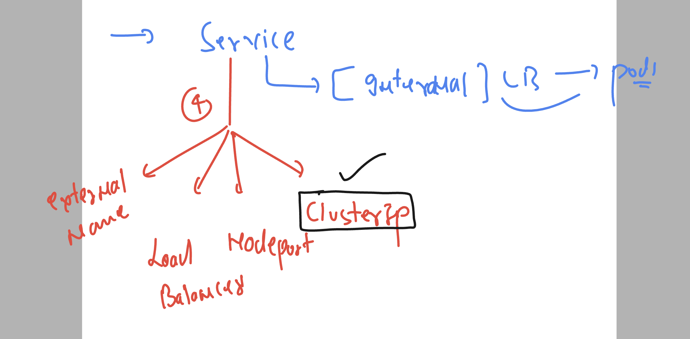

### openshift lab infra


## Understanding api resources of apiServer in openshift platform 


### delete resources forcefull 

```
oc delete pods --all --force
Warning: Immediate deletion does not wait for confirmation that the running resource has been terminated. The resource may continue to run on the cluster indefinitely.
pod "akki" force deleted
pod "ashupod1" force deleted
pod "asifpod1" force deleted
pod "macpod" force deleted
pod "ranjitpod" force deleted
pod "sachingpod" force deleted
pod "sachinpod11" force deleted
pod "sidpod1" force deleted

```

## understanding problem with pods 


### openshift controllers


## understanding RC->RS and downtime 


### FINALLy pods using deployment controller 


### Deployment controller in final terms 


## deploying container image using deployment 

### creating YAML file using oc cli 

```
227  oc  run  ashupod2 --image=dockerashu/ashutcs:webappv1 --port 80  --dry-run=client 
  228  oc  get pods
  229  oc  run  ashupod2 --image=dockerashu/ashutcs:webappv1 --port 80  --dry-run=client  -o yaml 
  230  oc  run  ashupod2 --image=dockerashu/ashutcs:webappv1 --port 80  --dry-run=client  -o yaml  >autopod.yaml 
  231  oc  run  ashupod2 --image=dockerashu/ashutcs:webappv1 --port 80  --dry-run=client  -o json 
  232  oc  run  ashupod2 --image=dockerashu/ashutcs:webappv1 --port 80  --dry-run=client  -o json >autopod.json

```

### creating pods 

```
[ashu@ip-172-31-16-156 ocp_manifests]$ oc  create -f autopod.json 
pod/ashupod2 created
[ashu@ip-172-31-16-156 ocp_manifests]$ 
[ashu@ip-172-31-16-156 ocp_manifests]$ 
[ashu@ip-172-31-16-156 ocp_manifests]$ 
[ashu@ip-172-31-16-156 ocp_manifests]$ 
[ashu@ip-172-31-16-156 ocp_manifests]$ 
[ashu@ip-172-31-16-156 ocp_manifests]$ oc  get  pods
NAME         READY   STATUS    RESTARTS   AGE
ashupod2     1/1     Running   0          5s
sachinpod2   1/1     Running   0          90s

```

### we can delete using file based request

```
oc  delete -f  autopod.json 
pod "ashupod2" deleted

```

### Deleting all the pods 

```
oc delete pods --all
pod "akki2" deleted
pod "akkijson" deleted
pod "asifpod2" deleted
pod "mypod" deleted
pod "sachindpod4" deleted
pod "sachindpod5" deleted
pod "sachinpod2" deleted
pod "sidpod2" deleted
pod "sidpod3" deleted

```

### creating deployment controller manifest yaml file 

```
oc  create deployment  ashuapp --image=dockerashu/ashutcs:webappv1  --port 80  --dry-run=client -o yaml >deploy1.yaml
```

### deploying controller

```
[ashu@ip-172-31-16-156 ocp_manifests]$ oc  create  -f deploy1.yaml 
deployment.apps/ashuapp created

===> checking 
[ashu@ip-172-31-16-156 ocp_manifests]$ oc  get  deployment 
NAME      READY   UP-TO-DATE   AVAILABLE   AGE
ashuapp   1/1     1            1           13s

===> Deployment -- create RS (replicaset)

ashu@ip-172-31-16-156 ocp_manifests]$ oc  get  replicasets
NAME               DESIRED   CURRENT   READY   AGE
ashuapp-99bdc766   1         1         1       81s
[ashu@ip-172-31-16-156 ocp_manifests]$ 

===> Replicasets -create pods 

 oc  get  pods
NAME                     READY   STATUS    RESTARTS   AGE
ashuapp-99bdc766-4tr5p   1/1     Running   0          87s
```

## Deployment offer self healing towards the pods 

```
 oc delete pods ashuapp-99bdc766-4tr5p 
pod "ashuapp-99bdc766-4tr5p" deleted

[ashu@ip-172-31-16-156 ocp_manifests]$ oc get pods -o wide
NAME                          READY   STATUS    RESTARTS   AGE     IP            NODE                          NOMINATED NODE   READINESS GATES
akki-597fcb6ff9-5rpgj         1/1     Running   0          10m     10.131.0.19   ip-10-0-95-84.ec2.internal    <none>           <none>
ashuapp-99bdc766-tjrxf        1/1     Running   0          6s      10.128.2.16   ip-10-0-95-205.ec2.internal   <none>           <none>
asifpod2-8544df856d-xv7zs     1/1     Running   0          3m5s    10.130.2.28   ip-10-0-90-155.ec2.internal   <none>           <none>
rcdeploy-c9f859b6-lkltg       1/1     Running   0          4m24s   10.131.0.20   ip-10-0-95-84.ec2.internal    <none>           <none>
sachinapp-5c9df67747-85hff    1/1     Running   0          2m52s   10.131.0.21   ip-10-0-95-84.ec2.internal    <none>           <none>
sachindapp-5cc7dddb54-2lj55   1/1     Running   0          9m54s   10.130.2.25   ip-10-0-90-155.ec2.internal   <none>           <none>
siddeploy-59fb455b87-gpbtm    1/1     Running   0          3m14s   10.130.2.27   ip-10-0-90-155.ec2.internal   <none>           <none>
```

### scaling pod horizentally using file updates

```
oc  apply  -f deploy1.yaml 
Warning: resource deployments/ashuapp is missing the kubectl.kubernetes.io/last-applied-configuration annotation which is required by oc apply. oc apply should only be used on resources created declaratively by either oc create --save-config or oc apply. The missing annotation will be patched automatically.
deployment.apps/ashuapp configured
[ashu@ip-172-31-16-156 ocp_manifests]$ 
[ashu@ip-172-31-16-156 ocp_manifests]$ oc get deployment 
NAME         READY   UP-TO-DATE   AVAILABLE   AGE
akki         1/1     1            1           12m
ashuapp      3/3     3            3           14m
asifpod2     1/1     1            1           5m19s
rcdeploy     1/1     1            1           6m38s
sachinapp    1/1     1            1           5m6s
sachindapp   1/1     1            1           12m
siddeploy    1/1     1            1           5m28s
[ashu@ip-172-31-16-156 ocp_manifests]$ oc  get pods
NAME                          READY   STATUS    RESTARTS   AGE
akki-597fcb6ff9-5rpgj         1/1     Running   0          12m
ashuapp-99bdc766-l2kqx        1/1     Running   0          22s
ashuapp-99bdc766-s6cpf        1/1     Running   0          22s
ashuapp-99bdc766-tjrxf        1/1     Running   0          2m32s
asifpod2-8544df856d-xv7zs     1/1     Running   0          5m31s
rcdeploy-c9f859b6-lkltg       1/1     Running   0          6m50s
sachinapp-5c9df67747-4z97q    1/1     Running   0          119s
sachindapp-5cc7dddb54-2lj55   1/1     Running   0          12m
siddeploy-59fb455b87-gpbtm    1/1     Running   0          5m40s
[ashu@ip-172-31-16-156 ocp_manifests]$ oc  get pods -o wide
NAME                          READY   STATUS    RESTARTS   AGE     IP            NODE                          NOMINATED NODE   READINESS GATES
akki-597fcb6ff9-5rpgj         1/1     Running   0          12m     10.131.0.19   ip-10-0-95-84.ec2.internal    <none>           <none>
ashuapp-99bdc766-l2kqx        1/1     Running   0          28s     10.130.2.29   ip-10-0-90-155.ec2.internal   <none>           <none>
ashuapp-99bdc766-s6cpf        1/1     Running   0          28s     10.131.0.23   ip-10-0-95-84.ec2.internal    <none>           <none>
ashuapp-99bdc766-tjrxf        1/1     Running   0          2m38s   10.128.2.16   ip-10-0-95-205.ec2.internal   <none>           <none>

```

### we can scale pods without yaml /json file as well 

```
oc  scale  deployment ashuapp  --replicas=1
deployment.apps/ashuapp scaled
[ashu@ip-172-31-16-156 ocp_manifests]$ 

[ashu@ip-172-31-16-156 ocp_manifests]$ oc get deployment 
NAME         READY   UP-TO-DATE   AVAILABLE   AGE
akki         3/3     3            3           18m
ashuapp      1/1     1            1           19m

```

### we can print yaml or json file from running pods/deployment 

```
ashu@ip-172-31-16-156 ocp_manifests]$ oc get deployment ashuapp    -o yaml 
apiVersion: apps/v1
kind: Deployment
metadata:

```

### options of scaling pods in opeshift 


### Understanding service --- internal LB in openshift / k8s


### service in more detail 


## service will find pods using label of pods 


### showing label of pods 

```
[ashu@ip-172-31-16-156 ocp_manifests]$ oc  get pods --show-labels
NAME                     READY   STATUS    RESTARTS   AGE     LABELS
ashuapp-99bdc766-9mcvl   1/1     Running   0          6m12s   app=ashuapp,pod-template-hash=99bdc766
ashuapp-99bdc766-d8b9v   1/1     Running   0          6m42s   app=ashuapp,pod-template-hash=99bdc766
[ashu@ip-172-31-16-156 ocp_manifests]$ 


```

### printing pods using labels 

```
ashu@ip-172-31-16-156 ocp_manifests]$ oc  get pods -l app=akki
NAME                    READY   STATUS    RESTARTS   AGE
akki-597fcb6ff9-b54zl   1/1     Running   0          4m53s
akki-597fcb6ff9-v7hzt   1/1     Running   0          4m54s
akki-597fcb6ff9-w2lt6   1/1     Running   0          4m53s
[ashu@ip-172-31-16-156 ocp_manifests]$ oc  get pods -l app=akki,pod-template-hash=597fcb6ff9
NAME                    READY   STATUS    RESTARTS   AGE
akki-597fcb6ff9-b54zl   1/1     Running   0          5m6s
akki-597fcb6ff9-v7hzt   1/1     Running   0          5m7s
akki-597fcb6ff9-w2lt6   1/1     Running   0          5m6s

```
### type of  service in ocp 



### creating clusterIP type service 


### demo 

```
329  oc  expose deployment ashuapp   --type ClusterIP --port 80 --name ashulb1 --dry-run=client -o yaml 
  330  oc  get  pods --show-labels 
  331  hsitor
  332  history 
[ashu@ip-172-31-16-156 ocp_manifests]$ 
[ashu@ip-172-31-16-156 ocp_manifests]$ 
[ashu@ip-172-31-16-156 ocp_manifests]$ oc  expose deployment ashuapp   --type ClusterIP --port 80 --name ashulb1 --dry-run=client -o yaml  >service.yaml
[ashu@ip-172-31-16-156 ocp_manifests]$ oc create -f service.yaml 
service/ashulb1 created
[ashu@ip-172-31-16-156 ocp_manifests]$ 
[ashu@ip-172-31-16-156 ocp_manifests]$ oc  get  svc 
NAME         TYPE           CLUSTER-IP      EXTERNAL-IP                            PORT(S)   AGE
ashulb1      ClusterIP      172.30.16.221   <none>                                 80/TCP    4s
kubernetes   ClusterIP      172.30.0.1      <none>                                 443/TCP   31h
openshift    ExternalName   <none>          kubernetes.default.svc.cluster.local   <none>    31h
[ashu@ip-172-31-16-156 ocp_manifests]$ oc  get  service
NAME         TYPE           CLUSTER-IP      EXTERNAL-IP                            PORT(S)   AGE
ashulb1      ClusterIP      172.30.16.221   <none>                                 80/TCP    9s
kubernetes   ClusterIP      172.30.0.1      <none>                                 443/TCP   31h
openshift    ExternalName   <none>          kubernetes.default.svc.cluster.local   <none>    31h
[ashu@ip-172-31-16-156 ocp_manifests]$ 

```


