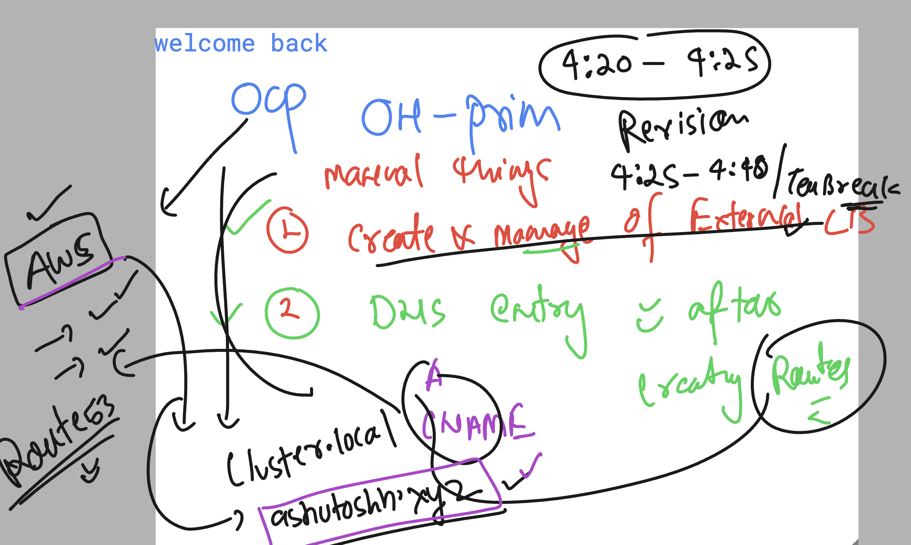
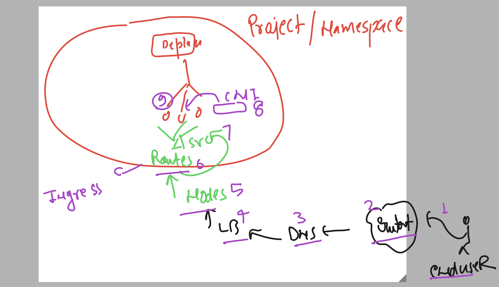
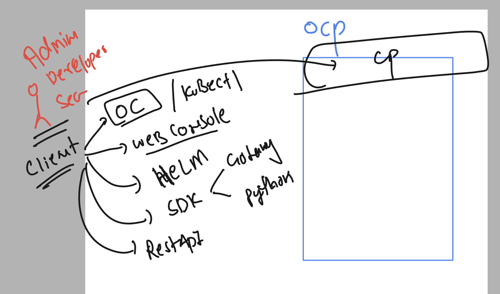
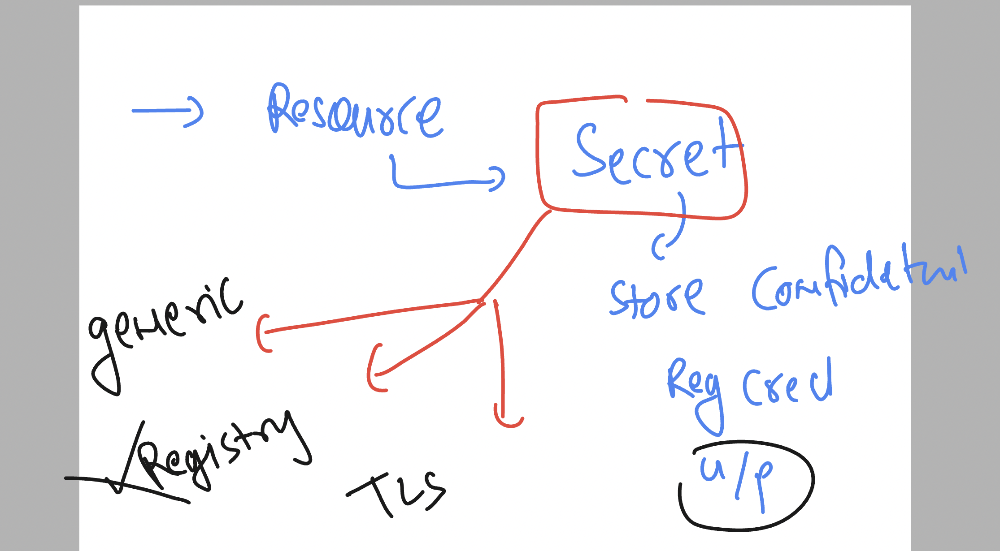

### Revision 

## checking projects 

```
 oc whoami
  432  oc  get nodes
  433  oc  project
  434  oc get  project
  435  oc project  ashu-app-project
  436  history 
  437  oc  project

```

## checking current project 

```
 oc  project 
Using project "ashu-app-project" on server "https://api.tcs-cluster.ashutoshh.xyz:6443".
```

### In openshift 3 onwards 

- if we deploy any docker image which is having root user access then it is not allowed in OCP project

```
[ashu@ip-172-31-16-156 ocp_manifests]$ docker  run -dit  --name ashucx1  dockerashu/ashutcs:webappv1 
9f1355cfef3194b578de728d96abe2be188772017a4572e9c17ab63a2fa9062b
[ashu@ip-172-31-16-156 ocp_manifests]$ docker ps
CONTAINER ID   IMAGE                         COMMAND                 CREATED         STATUS         PORTS     NAMES
9f1355cfef31   dockerashu/ashutcs:webappv1   "httpd -D FOREGROUND"   4 seconds ago   Up 2 seconds             ashucx1
[ashu@ip-172-31-16-156 ocp_manifests]$ 
[ashu@ip-172-31-16-156 ocp_manifests]$ 
[ashu@ip-172-31-16-156 ocp_manifests]$ docker  exec -it ashucx1  bash 
[root@9f1355cfef31 /]# 
[root@9f1355cfef31 /]# whoami
root

```

### we need to allow any container userid to run in openshift project 

```
oc adm policy add-scc-to-user anyuid -z default
# to allow current project to use any container image with any username 
```

### Creating deployment and checking it 

```
 oc  create  deployment  ashuday6app --image=dockerashu/ashutcs:webappv1 --port 80 --dry-run=client -o yaml >day6_deploy.yaml 
[ashu@ip-172-31-16-156 ocp_manifests]$ oc create  -f day6_deploy.yaml 
deployment.apps/ashuday6app created
[ashu@ip-172-31-16-156 ocp_manifests]$ oc  get  deploy 
NAME          READY   UP-TO-DATE   AVAILABLE   AGE
ashuday6app   1/1     1            1           4s
[ashu@ip-172-31-16-156 ocp_manifests]$ oc  get  pods
NAME                          READY   STATUS    RESTARTS   AGE
ashuday6app-f6ccbc8c4-mtr6l   1/1     Running   0          9s
[ashu@ip-172-31-16-156 ocp_manifests]$ 


```

### doing a manual scaling 

```
 oc  scale deployment  ashuday6app  --replicas 2 
deployment.apps/ashuday6app scaled
[ashu@ip-172-31-16-156 ocp_manifests]$ oc  get  deploy 
NAME          READY   UP-TO-DATE   AVAILABLE   AGE
ashuday6app   2/2     2            2           4m35s
[ashu@ip-172-31-16-156 ocp_manifests]$ oc  get  pods
NAME                          READY   STATUS    RESTARTS   AGE
ashuday6app-f6ccbc8c4-gb5mq   1/1     Running   0          6s
ashuday6app-f6ccbc8c4-mtr6l   1/1     Running   0          4m37s

```

### creating clusterIP type service by exposing deployment 

```
oc  get deploy 
NAME          READY   UP-TO-DATE   AVAILABLE   AGE
ashuday6app   2/2     2            2           6m16s
[ashu@ip-172-31-16-156 ocp_manifests]$ 
[ashu@ip-172-31-16-156 ocp_manifests]$ oc expose deployment  ashuday6app   --type ClusterIP --port 80 --name ashulb6 --dry-run=client -o yaml >day6svc.yml
[ashu@ip-172-31-16-156 ocp_manifests]$ 
[ashu@ip-172-31-16-156 ocp_manifests]$ oc get svc 
No resources found in ashu-app-project namespace.
[ashu@ip-172-31-16-156 ocp_manifests]$ oc get service 
No resources found in ashu-app-project namespace.
[ashu@ip-172-31-16-156 ocp_manifests]$ oc create -f day6svc.yml 
service/ashulb6 created
[ashu@ip-172-31-16-156 ocp_manifests]$ oc get  svc
NAME      TYPE        CLUSTER-IP    EXTERNAL-IP   PORT(S)   AGE
ashulb6   ClusterIP   172.30.3.32   <none>        80/TCP    3s
[ashu@ip-172-31-16-156 ocp_manifests]$ oc get  ep 
NAME      ENDPOINTS                       AGE
ashulb6   10.130.2.43:80,10.131.0.16:80   16s
[ashu@ip-172-31-16-156 ocp_manifests]$ oc  get po -o wide
NAME                          READY   STATUS    RESTARTS   AGE     IP            NODE                          NOMINATED NODE   READINESS GATES
ashuday6app-f6ccbc8c4-gb5mq   1/1     Running   0          3m      10.130.2.43   ip-10-0-90-155.ec2.internal   <none>           <none>
ashuday6app-f6ccbc8c4-mtr6l   1/1     Running   0          7m31s   10.131.0.16   ip-10-0-95-84.ec2.internal    <none>           <none>
[ashu@ip-172-31-16-156 ocp_manifests]$ 


```

### Understanding how end users are going to reach to app running in pods 


### Ingress controller to filter network traffic and forward connection to service of project


### Ingress controller in visual 


### ocp setup + ingress + external LB 


### verify ingress controller in OCP 

```
oc  get projects  | grep ingress
openshift-ingress                                                 Active
openshift-ingress-canary                                          Active
openshift-ingress-operator                                        Active
[ashu@ip-172-31-16-156 ocp_manifests]$ 
[ashu@ip-172-31-16-156 ocp_manifests]$ 
[ashu@ip-172-31-16-156 ocp_manifests]$ 
[ashu@ip-172-31-16-156 ocp_manifests]$ 
[ashu@ip-172-31-16-156 ocp_manifests]$ oc  get  deploy  -n  openshift-ingress
NAME             READY   UP-TO-DATE   AVAILABLE   AGE
router-default   2/2     2            2           4d6h
[ashu@ip-172-31-16-156 ocp_manifests]$ 
[ashu@ip-172-31-16-156 ocp_manifests]$ oc  get  pod  -n  openshift-ingress
NAME                              READY   STATUS    RESTARTS        AGE
router-default-77fdf7dd84-g97xh   1/1     Running   4               4d6h
router-default-77fdf7dd84-r6bq8   1/1     Running   5 (4h55m ago)   4d6h
[ashu@ip-172-31-16-156 ocp_manifests]$ 
[ashu@ip-172-31-16-156 ocp_manifests]$ oc  get svc  -n  openshift-ingress
NAME                      TYPE           CLUSTER-IP       EXTERNAL-IP                                                               PORT(S)                      AGE
router-default            LoadBalancer   172.30.37.144    a7f5853abac8446e0a4e3f884856458a-1366741115.us-east-1.elb.amazonaws.com   80:32674/TCP,443:31734/TCP   4d6h
router-internal-default   ClusterIP      172.30.146.218   <none>                                                                    80/TCP,443/TCP,1936/TCP      4d6h

```

### Internal DNS you have to entry for route domain 


### openshift on prim responsibility 


### ocp setup -- On_prim vs On cloud 




### creating routes 

```
[ashu@ip-172-31-16-156 ocp_manifests]$ oc  get svc 
NAME      TYPE        CLUSTER-IP    EXTERNAL-IP   PORT(S)   AGE
ashulb6   ClusterIP   172.30.3.32   <none>        80/TCP    92m
[ashu@ip-172-31-16-156 ocp_manifests]$ 
[ashu@ip-172-31-16-156 ocp_manifests]$ oc expose service ashulb6 


[ashu@ip-172-31-16-156 ocp_manifests]$ oc  get  routes
NAME      HOST/PORT                                                 PATH   SERVICES   PORT   TERMINATION   WILDCARD
ashulb6   ashulb6-ashu-app-project.apps.tcs-cluster.ashutoshh.xyz          ashulb6    80                   None

```

### network flow in openshift to access any app hosted in pods 



### cleaning up current project resources 

```
oc  delete all --all
pod "ashuday6app-f6ccbc8c4-gb5mq" deleted
pod "ashuday6app-f6ccbc8c4-mtr6l" deleted
service "ashulb6" deleted
deployment.apps "ashuday6app" deleted
replicaset.apps "ashuday6app-f6ccbc8c4" deleted
Warning: apps.openshift.io/v1 DeploymentConfig is deprecated in v4.14+, unavailable in v4.10000+
route.route.openshift.io "ashulb6" deleted

```

## understanding other oc client options 



### checking ocp web console details 

```
[ashu@ip-172-31-16-156 ocp_manifests]$ oc  get projects   | grep console 
openshift-console                                                 Active
openshift-console-operator                                        Active
openshift-console-user-settings                                   Active
[ashu@ip-172-31-16-156 ocp_manifests]$ 
[ashu@ip-172-31-16-156 ocp_manifests]$ 
[ashu@ip-172-31-16-156 ocp_manifests]$ oc  get deploy  -n  openshift-console
NAME        READY   UP-TO-DATE   AVAILABLE   AGE
console     2/2     2            2           4d7h
downloads   2/2     2            2           4d7h
[ashu@ip-172-31-16-156 ocp_manifests]$ oc  get po  -n  openshift-console
NAME                         READY   STATUS    RESTARTS        AGE
console-8554db79db-9krpw     1/1     Running   3               4d6h
console-8554db79db-sthvk     1/1     Running   3               4d6h
downloads-6456675cbd-cvc64   1/1     Running   3               4d7h
downloads-6456675cbd-gtg6j   1/1     Running   16 (6h6m ago)   4d7h
[ashu@ip-172-31-16-156 ocp_manifests]$ 
[ashu@ip-172-31-16-156 ocp_manifests]$ 
[ashu@ip-172-31-16-156 ocp_manifests]$ oc  get svc  -n  openshift-console
NAME        TYPE        CLUSTER-IP      EXTERNAL-IP   PORT(S)   AGE
console     ClusterIP   172.30.141.43   <none>        443/TCP   4d7h
downloads   ClusterIP   172.30.99.214   <none>        80/TCP    4d7h
[ashu@ip-172-31-16-156 ocp_manifests]$ 
[ashu@ip-172-31-16-156 ocp_manifests]$ oc  get routes  -n  openshift-console
NAME        HOST/PORT                                                    PATH   SERVICES    PORT    TERMINATION          WILDCARD
console     console-openshift-console.apps.tcs-cluster.ashutoshh.xyz            console     https   reencrypt/Redirect   None
downloads   downloads-openshift-console.apps.tcs-cluster.ashutoshh.xyz          downloads   http    edge/Redirect        None
```

## Deploying private registry container to opeshift 

```
[ashu@ip-172-31-16-156 ocp_manifests]$ docker  images  | grep ashu
dockerashu/ashutcs             webappv1   dcaa1198974f   7 days ago      538MB
ashuwebapp                     appv1      dcaa1198974f   7 days ago      538MB
[ashu@ip-172-31-16-156 ocp_manifests]$ 
[ashu@ip-172-31-16-156 ocp_manifests]$ 
[ashu@ip-172-31-16-156 ocp_manifests]$ 
[ashu@ip-172-31-16-156 ocp_manifests]$ docker  tag   ashuwebapp:appv1  tcsindia.azurecr.io/ashuapp:version1 
[ashu@ip-172-31-16-156 ocp_manifests]$ 
[ashu@ip-172-31-16-156 ocp_manifests]$ 
[ashu@ip-172-31-16-156 ocp_manifests]$ docker login  tcsindia.azurecr.io
Username: tcsindia
Password: 
WARNING! Your password will be stored unencrypted in /home/ashu/.docker/config.json.
Configure a credential helper to remove this warning. See
https://docs.docker.com/engine/reference/commandline/login/#credentials-store

Login Succeeded
[ashu@ip-172-31-16-156 ocp_manifests]$ docker  push tcsindia.azurecr.io/ashuapp:version1
The push refers to repository [tcsindia.azurecr.io/ashuapp]
6a79e9661aac: Pushed 
6bdd092574bb: Pushing [==============================>                    ]  185.2MB/304.3MB
e78cf5418e0f: Pushing [==================>                                ]  85.02MB/230.2MB


```

### if we deploy private image to openshift will get below error

```
ashu@ip-172-31-16-156 ocp_manifests]$ oc  get pods
NAME                       READY   STATUS             RESTARTS   AGE
ashuapp-84d89b4df5-54gkr   0/1     ImagePullBackOff   0          10m
[ashu@ip-172-31-16-156 ocp_manifests]$ 


Note: you can check oc describe pod  or check pod events section in webconsole 
```

### to store confidentail info we can use secrets in ocp 



### creating secret yaml to store registry secret 

```
[ashu@ip-172-31-16-156 ocp_manifests]$ oc  create secret 
Create a secret with specified type.

 A docker-registry type secret is for accessing a container registry.

 A generic type secret indicate an Opaque secret type.

 A tls type secret holds TLS certificate and its associated key.

Available Commands:
  docker-registry   Create a secret for use with a Docker registry
  generic           Create a secret from a local file, directory, or literal value
  tls               Create a TLS secret

Usage:
  oc create secret (docker-registry | generic | tls) [options]

Use "oc create secret <command> --help" for more information about a given command.
Use "oc options" for a list of global command-line options (applies to all commands).


===>
oc create secret docker-registry  ashu-reg-cred --docker-server tcsindia.azurecr.io --docker-username tcsindia  --docker-password="g" --dry-run=client -o yaml  >regsecret.yaml 
[ashu@ip-172-31-16-156 ocp_manifests]$ 
[ashu@ip-172-31-16-156 ocp_manifests]$ 
[ashu@ip-172-31-16-156 ocp_manifests]$ oc create -f regsecret.yaml 
secret/ashu-reg-cred created
[ashu@ip-172-31-16-156 ocp_manifests]$ oc get secrets 
NAME                       TYPE                             DATA   AGE
ashu-reg-cred              kubernetes.io/dockerconfigjson   1      4s
builder-dockercfg-qc9f7    kubernetes.io/dockercfg          1      3d
default-dockercfg-qffpp    kubernetes.io/dockercfg          1      3d
deployer-dockercfg-gl6nx   kubernetes.io/dockercfg          1      3d

```

### using secrets 

```
[ashu@ip-172-31-16-156 ocp_manifests]$ oc  create -f private.yaml 
deployment.apps/ashuapp created
[ashu@ip-172-31-16-156 ocp_manifests]$ 
[ashu@ip-172-31-16-156 ocp_manifests]$ 
[ashu@ip-172-31-16-156 ocp_manifests]$ oc  get deploy
NAME      READY   UP-TO-DATE   AVAILABLE   AGE
ashuapp   1/1     1            1           11s
[ashu@ip-172-31-16-156 ocp_manifests]$ oc  get pods
NAME                      READY   STATUS    RESTARTS   AGE
ashuapp-fbcd8f4bb-r5wz9   1/1     Running   0          15s
[ashu@ip-172-31-16-156 ocp_manifests]$ 
[ashu@ip-172-31-16-156 ocp_manifests]$ 
[ashu@ip-172-31-16-156 ocp_manifests]$ 

```


