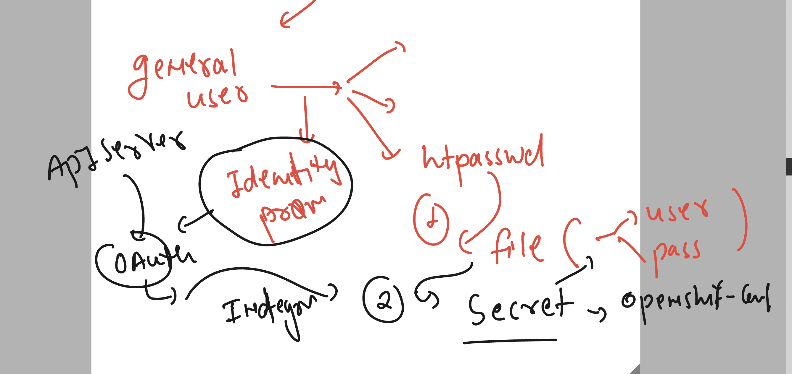
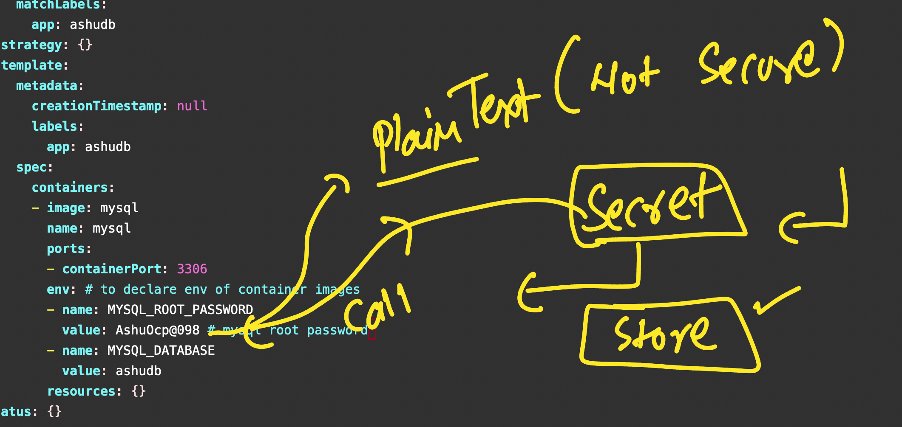
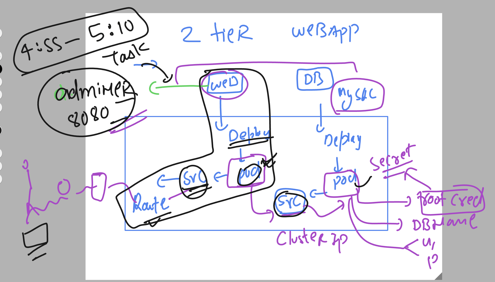

# ocp4_tcs_19thaug2024

### openshift cluster Understanding 


### understanding user and project relations 


### users type in oc platform 


### loging to super admin user using oc cli 

```
oc  login  https://api.tcs-cluster.ashutoshh.xyz:6443  -u kubeadmin -p "your kubeadmin password"  
error: tls: failed to verify certificate: x509: certificate signed by unknown authority

=====>>> to solve this error 
[ashu@ip-172-31-16-156 ~]$ oc  login  https://api.tcs-cluster.ashutoshh.xyz:6443  -u kubeadmin -p "your kubeadmin password"  --insecure-skip-tls-verify
WARNING: Using insecure TLS client config. Setting this option is not supported!

Login successful.

You have access to 76 projects, the list has been suppressed. You can list all projects with 'oc projects'

Using project "ashu-app-project".
[ashu@ip-172-31-16-156 ~]$ 
[ashu@ip-172-31-16-156 ~]$ oc  whoami
kube:admin
[ashu@ip-172-31-16-156 ~]$ 

```

### checking oauth existing method details 

```
oc  get oauth
NAME      AGE
cluster   5d5h
[ashu@ip-172-31-16-156 ~]$ oc  get oauth  cluster  -o yaml 
apiVersion: config.openshift.io/v1
kind: OAuth
metadata:
  annotations:
    include.release.openshift.io/ibm-cloud-managed: "true"
    include.release.openshift.io/self-managed-high-availability: "true"
    release.openshift.io/create-only: "true"
  creationTimestamp: "2024-08-22T04:12:11Z"
  generation: 3
  name: cluster
  ownerReferences:
  - apiVersion: config.openshift.io/v1
    kind: ClusterVersion
    name: version
    uid: 537a5137-e48b-4b4a-b9cc-bb6c30232540
  resourceVersion: "553457"
  uid: d40045b3-2f0f-4feb-8731-afaead6605a3
spec: {}

```

### lets try to create users using htpasswd commands 

### creating a command directory where you all can create and store users

```
root@ip-172-31-16-156 auth]# mkdir  /opt/users
[root@ip-172-31-16-156 auth]# chmod 777 /opt/users/
[root@ip-172-31-16-156 auth]# 


====> creating a normal user 

htpasswd   -cbB  /opt/users/ocp_creds      ashu  Ocp@12345 
Adding password for user ashu
[ashu@ip-172-31-16-156 ~]$ 
[ashu@ip-172-31-16-156 ~]$ cat  /opt/users/ocp_creds 
ashu:$2y$05$parf17rDQhFuudJRic8BzuENXrJGnLsrW8nIzFjugio2gdOKNsZj6
```

### to add more users 

```
 htpasswd   -bB  /opt/users/ocp_creds    test  Ocpnew@12345
Adding password for user test


=>>>
cat  /opt/users/ocp_creds 
asiftest:$2y$05$oJI1DALmJLYI8ZP1c7BE8OHHlEbQ/7HPLKmP/fqOfrYWPTlLOniX6
saching:$2y$05$udAQZrUDn4lBSKfpfaz6AOqxwZJ7YehMHoVO1/LymU/ht0Rdzprg6
manadark:$2y$05$zFIVSDm/cBK/zF5JU1AA7uIaLliXyKroHtony6O42pvmsFZ69ApT2
test:$2y$05$VBKE.phVa1fe/Aq1m1g0PehK59bgZ3tRH4iW1y9hjT//DTK58yiLy
```


### openshfit by default don't know about the file we created user details 


### creating secret in openshift-config project to point above file info 


### searching for project exact name 

```
oc  get  projects  | grep openshift  | grep config 
openshift-cloud-network-config-controller                         Active
openshift-config                                                  Active
openshift-config-managed                                          Active
openshift-config-operator                                         Active
openshift-machine-config-operator                                 Active
[ashu@ip-172-31-16-156 ~]$ 


```

### creating secret to store user file 

```
oc  create secret generic  ashu-cred-details --from-file  htpasswd=/opt/users/ocp_creds  --dry-run=client -o yaml -n    openshift-config  >secret1.yaml 
[ashu@ip-172-31-16-156 users_manifest]$ oc create -f secret1.yaml 
secret/ashu-cred-details created
[ashu@ip-172-31-16-156 users_manifest]$ oc  get secrets  -n openshift-config
NAME                                      TYPE                             DATA   AGE
ashu-cred-details                         Opaque                           1      12s
builder-dockercfg-xd9nl                   kubernetes.io/dockercfg          1      5d5h
default-dockercfg-hmw2w                   kubernetes.io/dockercfg          1      5d5h
deployer-dockercfg-ftptf                  kubernetes.io/dockercfg          1      5d5h


```

### integration of apiServer with method / user providers 


### create yaml file and do apply 

```
[ashu@ip-172-31-16-156 users_manifest]$ cat  oauth.yaml 
apiVersion: config.openshift.io/v1
kind: OAuth
metadata:
  name: cluster
spec:
  identityProviders:
  - name: my_htpasswd_provider 
    mappingMethod: claim 
    type: HTPasswd
    htpasswd:
      fileData:
        name: ashu-cred-details # name of create 
```

### apply it 

```
oc apply  -f oauth.yaml
```

### now we can login with the users we created 

```

oc  login  https://api.tcs-cluster.ashutoshh.xyz:6443  -u test1  -p Ocp@12345  --insecure-skip-tls-verify
WARNING: Using insecure TLS client config. Setting this option is not supported!

Login successful.

You don't have any projects. You can try to create a new project, by running

    oc new-project <projectname>


```

### new user we have created is not having any permission at all 

```
ashu@ip-172-31-16-156 users_manifest]$ oc  whoami 
test1
[ashu@ip-172-31-16-156 users_manifest]$ 
[ashu@ip-172-31-16-156 users_manifest]$ oc  get  pods
Error from server (Forbidden): pods is forbidden: User "test1" cannot list resource "pods" in API group "" in the namespace "default"
[ashu@ip-172-31-16-156 users_manifest]$ 
[ashu@ip-172-31-16-156 users_manifest]$ 
[ashu@ip-172-31-16-156 users_manifest]$ oc  get  nodes
Error from server (Forbidden): nodes is forbidden: User "test1" cannot list resource "nodes" in API group "" at the cluster scope
[ashu@ip-172-31-16-156 users_manifest]$ 
[ashu@ip-172-31-16-156 users_manifest]$ oc  version 
Client Version: 4.16.6
Kustomize Version: v5.0.4-0.20230601165947-6ce0bf390ce3
Kubernetes Version: v1.29.6+aba1e8d
[ashu@ip-172-31-16-156 users_manifest]$ oc  cluster-info 

To further debug and diagnose cluster problems, use 'kubectl cluster-info dump'.
Error from server (Forbidden): services is forbidden: User "test1" cannot list resource "services" in API group "" in the namespace "kube-system"
[ashu@ip-172-31-16-156 users_manifest]$ 


```

### user process understanding 



### creating multiple users for you all 

```
for  i  in  aakash1  asif1 jeetandraY1 jitendra1 mandar1 noor1 ranjit1 sachinD1 sachinG1 vivek1 
> do
> htpasswd   -bB  creds  $i Ocp@12345
> done
Adding password for user aakash1
Adding password for user asif1
Adding password for user jeetandraY1
Adding password for user jitendra1
Adding password for user mandar1
Adding password for user noor1
Adding password for user ranjit1
Adding password for user sachinD1
Adding password for user sachinG1
Adding password for user vivek1
[ashu@ip-172-31-16-156 users_manifest]$ cat  creds 
ashu:$2y$05$BVa7jVUHi9x.YwbcNXKYBOqAZK0nOm7E85U2JTys7Vnusm7k7zx36

```

### new user can create project 

```
 oc  new-project   ashu-personal 
Now using project "ashu-personal" on server "https://api.tcs-cluster.ashutoshh.xyz:6443".

You can add applications to this project with the 'new-app' command. For example, try:

    oc new-app rails-postgresql-example

to build a new example application in Ruby. Or use kubectl to deploy a simple Kubernetes application:

    kubectl create deployment hello-node --image=registry.k8s.io/e2e-test-images/agnhost:2.43 -- /agnhost serve-hostname

[ashu@ip-172-31-16-156 users_manifest]$ oc project
Using project "ashu-personal" on server "https://api.tcs-cluster.ashutoshh.xyz:6443".
[ashu@ip-172-31-16-156 users_manifest]$ 


```

## Deploying adminer docker image and try to access it 

```
oc create deployment  ashu-ui --image=adminer --port 8080 --dry-run=client -o yaml >webdeploy.yaml 
[ashu@ip-172-31-16-156 tasks]$ oc create -f webdeploy.yaml 
deployment.apps/ashu-ui created
[ashu@ip-172-31-16-156 tasks]$ oc  get deploy 
NAME      READY   UP-TO-DATE   AVAILABLE   AGE
ashu-ui   0/1     1            0           4s
[ashu@ip-172-31-16-156 tasks]$ oc  get  pods
NAME                       READY   STATUS    RESTARTS   AGE
ashu-ui-745c8cc5c8-rqg47   1/1     Running   0          10s
[ashu@ip-172-31-16-156 tasks]$ oc  get  pods
NAME                       READY   STATUS    RESTARTS   AGE
ashu-ui-745c8cc5c8-rqg47   1/1     Running   0          19s
[ashu@ip-172-31-16-156 tasks]$ oc  expose deployment  ashu-ui  --type ClusterIP --port 8080 --name weblb --dry-run=client -o yaml >websvc.yml 
[ashu@ip-172-31-16-156 tasks]$ oc create -f websvc.yml 
service/weblb created
[ashu@ip-172-31-16-156 tasks]$ oc get svc
NAME    TYPE        CLUSTER-IP      EXTERNAL-IP   PORT(S)    AGE
weblb   ClusterIP   172.30.134.43   <none>        8080/TCP   2s
[ashu@ip-172-31-16-156 tasks]$ oc get ep 
NAME    ENDPOINTS          AGE
weblb   10.130.2.35:8080   5s
[ashu@ip-172-31-16-156 tasks]$ oc expose service weblb 
route/weblb exposed
[ashu@ip-172-31-16-156 tasks]$ oc get  routes.route.openshift.io 
NAME    HOST/PORT                                            PATH   SERVICES   PORT   TERMINATION   WILDCARD
weblb   weblb-ashu-personal.apps.tcs-cluster.ashutoshh.xyz          weblb      8080                 None
[ashu@ip-172-31-16-156 tasks]$ 
[ashu@ip-172-31-16-156 tasks]$ oc get routes
NAME    HOST/PORT                                            PATH   SERVICES   PORT   TERMINATION   WILDCARD
weblb   weblb-ashu-personal.apps.tcs-cluster.ashutoshh.xyz          weblb      8080                 None
```

## storing password like info in secret 




### creating secrets 

```
oc create secret 
Create a secret with specified type.

 A docker-registry type secret is for accessing a container registry.

 A generic type secret indicate an Opaque secret type.

 A tls type secret holds TLS certificate and its associated key.

Available Commands:
  docker-registry   Create a secret for use with a Docker registry
  generic           Create a secret from a local file, directory, or literal value
  tls               Create a TLS secret

Usage:
  oc create secret (docker-registry | generic | tls) [options]

Use "oc create secret <command> --help" for more information about a given command.
Use "oc options" for a list of global command-line options (applies to all commands).


[ashu@ip-172-31-16-156 tasks]$ oc create secret  generic ashu-db-creds --from-literal  db_password=AshudbOcp@098 --dry-run=client -o yaml >rootsecret.yml

[ashu@ip-172-31-16-156 tasks]$ ls
db_deloy.yaml  rootsecret.yml  webdeploy.yaml  websvc.yml
[ashu@ip-172-31-16-156 tasks]$ cat  rootsecret.yml 
apiVersion: v1
data:
  db_password: QXNodWRiT2NwQDA5OA==
kind: Secret
metadata:
  creationTimestamp: null
  name: ashu-db-creds


[ashu@ip-172-31-16-156 tasks]$ oc  create -f rootsecret.yml 
secret/ashu-db-creds created
[ashu@ip-172-31-16-156 tasks]$ oc  get  secrets 
NAME                       TYPE                      DATA   AGE
ashu-db-creds              Opaque                    1      4s
builder-dockercfg-jz8lx    kubernetes.io/dockercfg   1      43m

```


### using secret in deployment yaml 

```
apiVersion: apps/v1
kind: Deployment
metadata:
  creationTimestamp: null
  labels:
    app: ashudb
  name: ashudb
spec:
  replicas: 1
  selector:
    matchLabels:
      app: ashudb
  strategy: {}
  template:
    metadata:
      creationTimestamp: null
      labels:
        app: ashudb
    spec:
      containers:
      - image: mysql
        name: mysql
        ports:
        - containerPort: 3306
        env: # to declare env of container images
        - name: MYSQL_ROOT_PASSWORD
          valueFrom: # reading value from external 
            secretKeyRef: # calling secret 
              name: ashu-db-creds # name of secret 
              key: db_password # key of secret 
        - name: MYSQL_DATABASE
          value: ashudb 
        resources: {}
status: {}

```

### creating db deployment yaml and also creating service

```
ashu@ip-172-31-16-156 tasks]$ ls
db_deloy.yaml  rootsecret.yml  webdeploy.yaml  websvc.yml
[ashu@ip-172-31-16-156 tasks]$ oc create -f db_deloy.yaml 
deployment.apps/ashudb created
[ashu@ip-172-31-16-156 tasks]$ 
[ashu@ip-172-31-16-156 tasks]$ oc  get  deploy 
NAME      READY   UP-TO-DATE   AVAILABLE   AGE
ashu-ui   1/1     1            1           29m
ashudb    0/1     1            0           5s
[ashu@ip-172-31-16-156 tasks]$ oc  get  pods
NAME                       READY   STATUS              RESTARTS   AGE
ashu-ui-745c8cc5c8-rqg47   1/1     Running             0          29m
ashudb-587c998967-f8qh9    0/1     ContainerCreating   0          13s
[ashu@ip-172-31-16-156 tasks]$ oc  get  pods
NAME                       READY   STATUS    RESTARTS   AGE
ashu-ui-745c8cc5c8-rqg47   1/1     Running   0          29m
ashudb-587c998967-f8qh9    1/1     Running   0          21s
[ashu@ip-172-31-16-156 tasks]$ oc  expose  deployment  ashudb  --type ClusterIP --port 3306 --name ashdblb --dry-run=client -o yaml >dbsvc.yml 
[ashu@ip-172-31-16-156 tasks]$ oc create -f dbsvc.yml 
service/ashdblb created
[ashu@ip-172-31-16-156 tasks]$ oc  get svc
NAME      TYPE        CLUSTER-IP       EXTERNAL-IP   PORT(S)    AGE
ashdblb   ClusterIP   172.30.116.106   <none>        3306/TCP   3s
weblb     ClusterIP   172.30.134.43    <none>        8080/TCP   29m
[ashu@ip-172-31-16-156 tasks]$ oc  get ep 
NAME      ENDPOINTS          AGE
ashdblb   10.130.2.37:3306   5s
weblb     10.130.2.35:8080   29m
[ashu@ip-172-31-16-156 tasks]$ 

```

### history of adminer + mysql deployment 

```
725  cd  tasks/
  726  ls
  727  oc create deployment  ashu-ui --image=adminer --port 8080 --dry-run=client -o yaml >webdeploy.yaml 
  728  oc create -f webdeploy.yaml 
  729  oc  get deploy 
  730  oc  get  pods
  731  oc  expose deployment  ashu-ui  --type ClusterIP --port 8080 --name weblb --dry-run=client -o yaml >websvc.yml 
  732  oc create -f websvc.yml 
  733  oc get svc
  734  oc get ep 
  735  oc expose service weblb 
  736  oc get  routes.route.openshift.io 
  737  oc get routes
  738  oc  exec -it ashu-ui-745c8cc5c8-rqg47  -- bash 
  739  history 
  740  ls
  741  oc  create  deployment  ashudb --image=mysql --port 3306  --dry-run=client -o yaml >db_deloy.yaml 
  742  ls
  743  vim   db_deloy.yaml 
  744  oc create secret 
  745  oc create secret  generic ashu-db-creds --from-literal  db_password=AshudbOcp@098 --dry-run=client -o yaml >rootsecret.yml
  746  ls
  747  cat  rootsecret.yml 
  748  oc  create -f rootsecret.yml 
  749  oc  get  secrets 
  750  history 
  751  vim  db_deloy.yaml 
  752  cat  db_deloy.yaml 
  753  history 
  754  ls
  755  cd ocp_manifests/
  756  ls
  757  cd users_manifest/
  758  ls
  759  cd tasks/
  760  ls
  761  oc create -f db_deloy.yaml 
  762  oc  get  deploy 
  763  oc  get  pods
  764  oc  expose  deployment  ashudb  --type ClusterIP --port 3306 --name ashdblb --dry-run=client -o yaml >dbsvc.yml 
  765  oc create -f dbsvc.yml 

```

### flow diagram of 2 tier webapp




