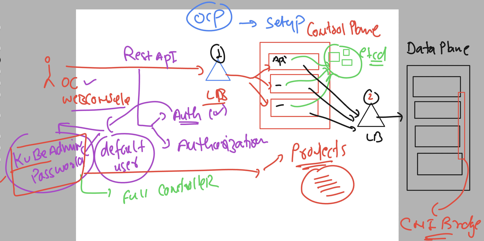
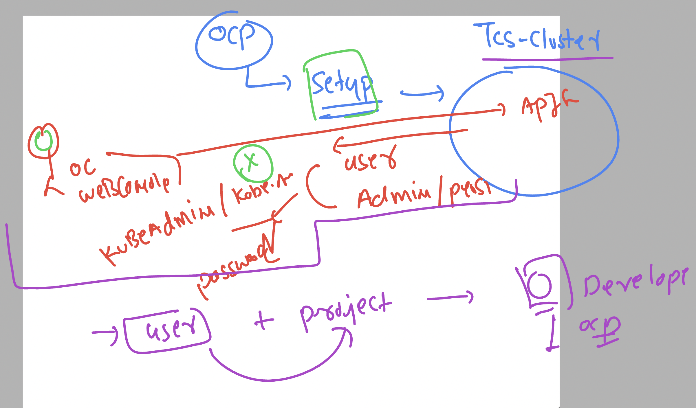
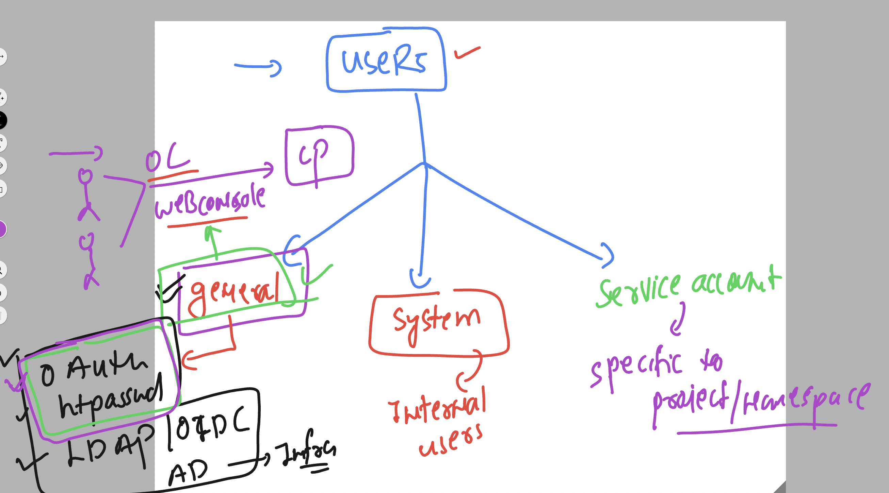
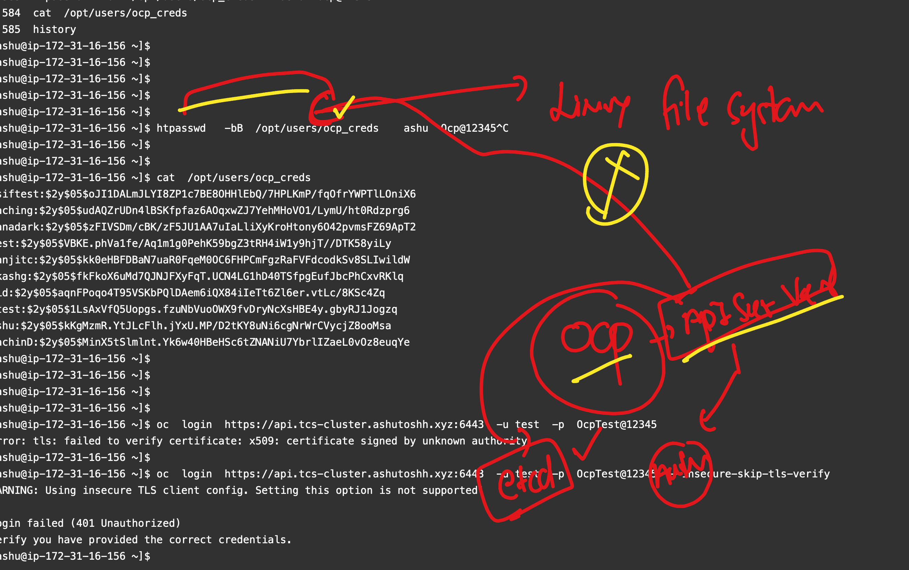
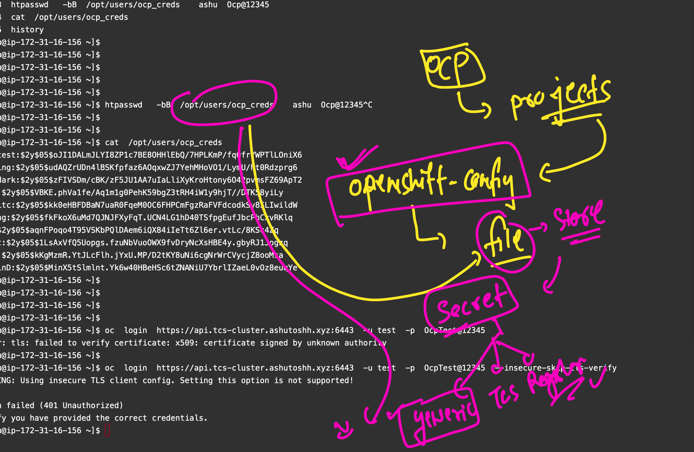
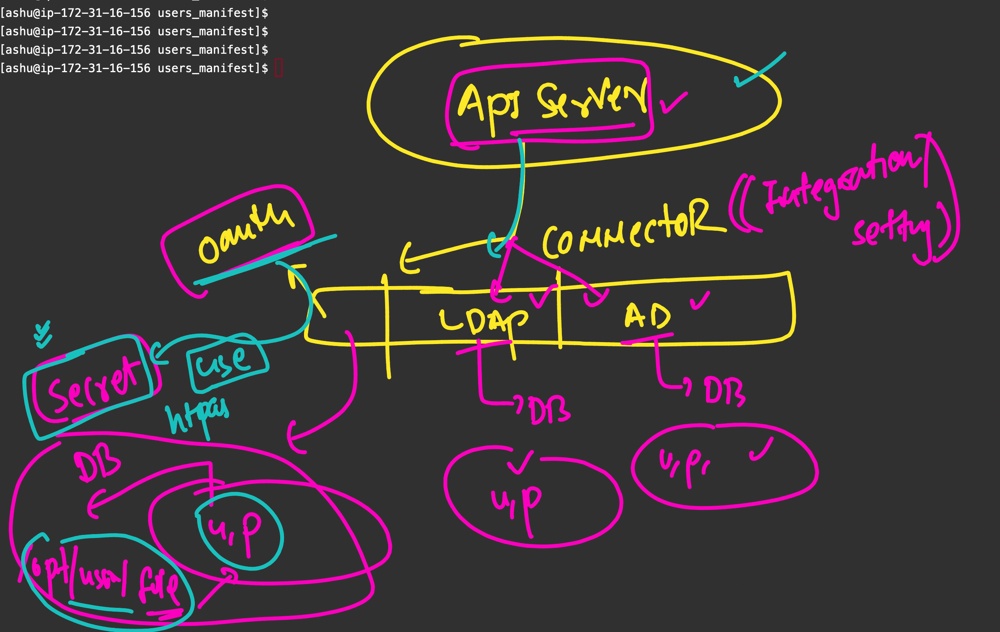

# ocp4_tcs_19thaug2024

### openshift cluster Understanding 



### understanding user and project relations 



### users type in oc platform 




### loging to super admin user using oc cli 

```
oc  login  https://api.tcs-cluster.ashutoshh.xyz:6443  -u kubeadmin -p "your kubeadmin password"  
error: tls: failed to verify certificate: x509: certificate signed by unknown authority

=====>>> to solve this error 
[ashu@ip-172-31-16-156 ~]$ oc  login  https://api.tcs-cluster.ashutoshh.xyz:6443  -u kubeadmin -p "your kubeadmin password"  --insecure-skip-tls-verify
WARNING: Using insecure TLS client config. Setting this option is not supported!

Login successful.

You have access to 76 projects, the list has been suppressed. You can list all projects with 'oc projects'

Using project "ashu-app-project".
[ashu@ip-172-31-16-156 ~]$ 
[ashu@ip-172-31-16-156 ~]$ oc  whoami
kube:admin
[ashu@ip-172-31-16-156 ~]$ 

```

### checking oauth existing method details 

```
oc  get oauth
NAME      AGE
cluster   5d5h
[ashu@ip-172-31-16-156 ~]$ oc  get oauth  cluster  -o yaml 
apiVersion: config.openshift.io/v1
kind: OAuth
metadata:
  annotations:
    include.release.openshift.io/ibm-cloud-managed: "true"
    include.release.openshift.io/self-managed-high-availability: "true"
    release.openshift.io/create-only: "true"
  creationTimestamp: "2024-08-22T04:12:11Z"
  generation: 3
  name: cluster
  ownerReferences:
  - apiVersion: config.openshift.io/v1
    kind: ClusterVersion
    name: version
    uid: 537a5137-e48b-4b4a-b9cc-bb6c30232540
  resourceVersion: "553457"
  uid: d40045b3-2f0f-4feb-8731-afaead6605a3
spec: {}

```

### lets try to create users using htpasswd commands 

### creating a command directory where you all can create and store users

```
root@ip-172-31-16-156 auth]# mkdir  /opt/users
[root@ip-172-31-16-156 auth]# chmod 777 /opt/users/
[root@ip-172-31-16-156 auth]# 


====> creating a normal user 

htpasswd   -cbB  /opt/users/ocp_creds      ashu  Ocp@12345 
Adding password for user ashu
[ashu@ip-172-31-16-156 ~]$ 
[ashu@ip-172-31-16-156 ~]$ cat  /opt/users/ocp_creds 
ashu:$2y$05$parf17rDQhFuudJRic8BzuENXrJGnLsrW8nIzFjugio2gdOKNsZj6
```

### to add more users 

```
 htpasswd   -bB  /opt/users/ocp_creds    test  Ocpnew@12345
Adding password for user test


=>>>
cat  /opt/users/ocp_creds 
asiftest:$2y$05$oJI1DALmJLYI8ZP1c7BE8OHHlEbQ/7HPLKmP/fqOfrYWPTlLOniX6
saching:$2y$05$udAQZrUDn4lBSKfpfaz6AOqxwZJ7YehMHoVO1/LymU/ht0Rdzprg6
manadark:$2y$05$zFIVSDm/cBK/zF5JU1AA7uIaLliXyKroHtony6O42pvmsFZ69ApT2
test:$2y$05$VBKE.phVa1fe/Aq1m1g0PehK59bgZ3tRH4iW1y9hjT//DTK58yiLy
```


### openshfit by default don't know about the file we created user details 



### creating secret in openshift-config project to point above file info 



### searching for project exact name 

```
oc  get  projects  | grep openshift  | grep config 
openshift-cloud-network-config-controller                         Active
openshift-config                                                  Active
openshift-config-managed                                          Active
openshift-config-operator                                         Active
openshift-machine-config-operator                                 Active
[ashu@ip-172-31-16-156 ~]$ 


```

### creating secret to store user file 

```
oc  create secret generic  ashu-cred-details --from-file  htpasswd=/opt/users/ocp_creds  --dry-run=client -o yaml -n    openshift-config  >secret1.yaml 
[ashu@ip-172-31-16-156 users_manifest]$ oc create -f secret1.yaml 
secret/ashu-cred-details created
[ashu@ip-172-31-16-156 users_manifest]$ oc  get secrets  -n openshift-config
NAME                                      TYPE                             DATA   AGE
ashu-cred-details                         Opaque                           1      12s
builder-dockercfg-xd9nl                   kubernetes.io/dockercfg          1      5d5h
default-dockercfg-hmw2w                   kubernetes.io/dockercfg          1      5d5h
deployer-dockercfg-ftptf                  kubernetes.io/dockercfg          1      5d5h


```

### integration of apiServer with method / user providers 




### create yaml file and do apply 

```
[ashu@ip-172-31-16-156 users_manifest]$ cat  oauth.yaml 
apiVersion: config.openshift.io/v1
kind: OAuth
metadata:
  name: cluster
spec:
  identityProviders:
  - name: my_htpasswd_provider 
    mappingMethod: claim 
    type: HTPasswd
    htpasswd:
      fileData:
        name: ashu-cred-details # name of create 
```

### apply it 

```
oc apply  -f oauth.yaml
```

### now we can login with the users we created 

```

oc  login  https://api.tcs-cluster.ashutoshh.xyz:6443  -u test1  -p Ocp@12345  --insecure-skip-tls-verify
WARNING: Using insecure TLS client config. Setting this option is not supported!

Login successful.

You don't have any projects. You can try to create a new project, by running

    oc new-project <projectname>


```


