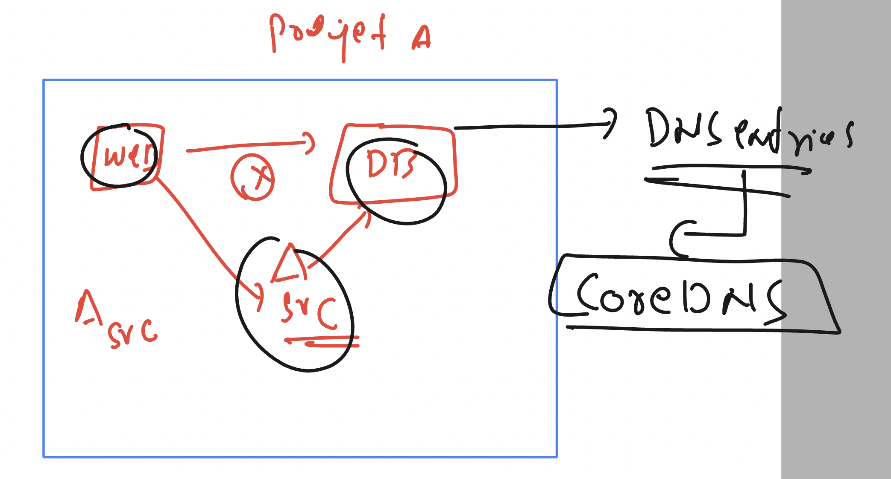

### checking lab details 

```

[ashu@ip-172-31-16-156 ~]$ oc whoami
test1
[ashu@ip-172-31-16-156 ~]$ oc  project
Using project "ashu-personal" on server "https://api.tcs-cluster.ashutoshh.xyz:6443".
[ashu@ip-172-31-16-156 ~]$ oc  get all
Warning: apps.openshift.io/v1 DeploymentConfig is deprecated in v4.14+, unavailable in v4.10000+
NAME                           READY   STATUS    RESTARTS   AGE
pod/ashu-ui-745c8cc5c8-rqg47   1/1     Running   1          21h
pod/ashudb-587c998967-f8qh9    1/1     Running   1          20h

NAME              TYPE        CLUSTER-IP       EXTERNAL-IP   PORT(S)    AGE
service/ashdblb   ClusterIP   172.30.116.106   <none>        3306/TCP   20h
service/weblb     ClusterIP   172.30.134.43    <none>        8080/TCP   21h

NAME                      READY   UP-TO-DATE   AVAILABLE   AGE
deployment.apps/ashu-ui   1/1     1            1           21h
deployment.apps/ashudb    1/1     1            1           20h

NAME                                 DESIRED   CURRENT   READY   AGE
replicaset.apps/ashu-ui-745c8cc5c8   1         1         1       21h
replicaset.apps/ashudb-587c998967    1         1         1       20h

NAME                             HOST/PORT                                            PATH   SERVICES   PORT   TERMINATION   WILDCARD
route.route.openshift.io/weblb   weblb-ashu-personal.apps.tcs-cluster.ashutoshh.xyz          weblb      8080                 None
[ashu@ip-172-31-16-156 ~]$ oc  delete all --all
pod "ashu-ui-745c8cc5c8-rqg47" deleted
pod "ashudb-587c998967-f8qh9" deleted
service "ashdblb" deleted
service "weblb" deleted
deployment.apps "ashu-ui" deleted
deployment.apps "ashudb" deleted
Warning: apps.openshift.io/v1 DeploymentConfig is deprecated in v4.14+, unavailable in v4.10000+
route.route.openshift.io "weblb" deleted

```

### CoreDNS understanding 



### task updates 

### creating webapp in ashu-personal namespace 

```
[ashu@ip-172-31-16-156 tasks]$ oc  create  -f  webdeploy.yaml   -f websvc.yml 
deployment.apps/ashu-ui created
service/weblb created

[ashu@ip-172-31-16-156 tasks]$ oc  get  deploy
NAME      READY   UP-TO-DATE   AVAILABLE   AGE
ashu-ui   1/1     1            1           4s

[ashu@ip-172-31-16-156 tasks]$ oc  get  svc
NAME    TYPE        CLUSTER-IP      EXTERNAL-IP   PORT(S)    AGE
weblb   ClusterIP   172.30.88.151   <none>        8080/TCP   8s

[ashu@ip-172-31-16-156 tasks]$ oc  get  ep
NAME    ENDPOINTS          AGE
weblb   10.130.2.19:8080   11s

[ashu@ip-172-31-16-156 tasks]$ oc  expose service weblb 
route/weblb exposed
[ashu@ip-172-31-16-156 tasks]$ oc  get  routes
NAME    HOST/PORT                                            PATH   SERVICES   PORT   TERMINATION   WILDCARD
weblb   weblb-ashu-personal.apps.tcs-cluster.ashutoshh.xyz          weblb      8080                 None
[ashu@ip-172-31-16-156 tasks]$ 

```

### creating a new-project and there deployment of db 

```
[ashu@ip-172-31-16-156 tasks]$ oc  new-project  ashu-db-space 
Now using project "ashu-db-space" on server "https://api.tcs-cluster.ashutoshh.xyz:6443".

You can add applications to this project with the 'new-app' command. For example, try:

    oc new-app rails-postgresql-example

to build a new example application in Ruby. Or use kubectl to deploy a simple Kubernetes application:

    kubectl create deployment hello-node --image=registry.k8s.io/e2e-test-images/agnhost:2.43 -- /agnhost serve-hostname

[ashu@ip-172-31-16-156 tasks]$ oc  project
Using project "ashu-db-space" on server "https://api.tcs-cluster.ashutoshh.xyz:6443".
[ashu@ip-172-31-16-156 tasks]$ ls
db_deloy.yaml  dbsvc.yml  rootsecret.yml  webdeploy.yaml  websvc.yml
[ashu@ip-172-31-16-156 tasks]$ oc  create  -f rootsecret.yml -f db_deloy.yaml  -f dbsvc.yml 
secret/ashu-db-creds created
deployment.apps/ashudb created
service/ashdblb created
[ashu@ip-172-31-16-156 tasks]$ oc  get  secret
NAME                       TYPE                      DATA   AGE
ashu-db-creds              Opaque                    1      6s
builder-dockercfg-psg2d    kubernetes.io/dockercfg   1      51s
default-dockercfg-kgdc7    kubernetes.io/dockercfg   1      51s
deployer-dockercfg-gp225   kubernetes.io/dockercfg   1      51s
[ashu@ip-172-31-16-156 tasks]$ oc  get  deploy
NAME     READY   UP-TO-DATE   AVAILABLE   AGE
ashudb   1/1     1            1           10s
[ashu@ip-172-31-16-156 tasks]$ oc  get  po
NAME                      READY   STATUS    RESTARTS   AGE
ashudb-587c998967-8msjs   1/1     Running   0          14s
[ashu@ip-172-31-16-156 tasks]$ oc  get  svc
NAME      TYPE        CLUSTER-IP      EXTERNAL-IP   PORT(S)    AGE
ashdblb   ClusterIP   172.30.62.232   <none>        3306/TCP   19s

```

### checking from pod1 to pod2 

```
ashu@ip-172-31-16-156 ~]$ oc get deploy 
NAME     READY   UP-TO-DATE   AVAILABLE   AGE
ashudb   1/1     1            1           27m
[ashu@ip-172-31-16-156 ~]$ oc  run  webclient --image=alpine  --command sleep 100000 
pod/webclient created
[ashu@ip-172-31-16-156 ~]$ oc  get  pods
NAME                      READY   STATUS    RESTARTS   AGE
ashudb-587c998967-8msjs   1/1     Running   0          27m
webclient                 1/1     Running   0          4s
[ashu@ip-172-31-16-156 ~]$ 
[ashu@ip-172-31-16-156 ~]$ oc get project  | grep -i ashu
ashu-db-space                  Active
ashu-personal                  Active
[ashu@ip-172-31-16-156 ~]$ oc  get  pods -o wide  -n  ashu-personal 
NAME                       READY   STATUS    RESTARTS   AGE   IP            NODE                          NOMINATED NODE   READINESS GATES
ashu-ui-745c8cc5c8-h9jnp   1/1     Running   0          34m   10.130.2.19   ip-10-0-90-155.ec2.internal   <none>           <none>
[ashu@ip-172-31-16-156 ~]$ 
[ashu@ip-172-31-16-156 ~]$ 
[ashu@ip-172-31-16-156 ~]$ oc  get pods
NAME                      READY   STATUS    RESTARTS   AGE
ashudb-587c998967-8msjs   1/1     Running   0          30m
webclient                 1/1     Running   0          2m25s
[ashu@ip-172-31-16-156 ~]$ oc  exec -it webclient -- sh 
~ $ 
~ $ ping  10.130.2.19
PING 10.130.2.19 (10.130.2.19): 56 data bytes
64 bytes from 10.130.2.19: seq=0 ttl=42 time=1.755 ms
64 bytes from 10.130.2.19: seq=1 ttl=42 time=0.801 ms
^C
--- 10.130.2.19 ping statistics ---

```

