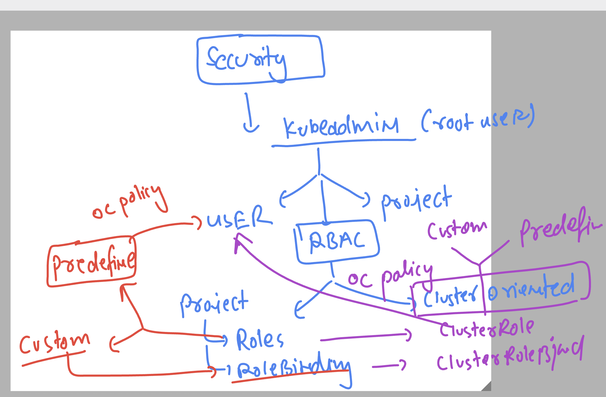
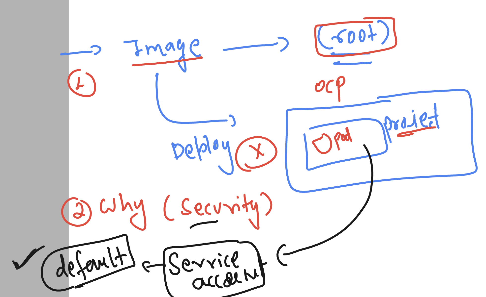

# ocp4_tcs_19thaug2024

### Understanding openshift Engineering 


### Overall ocp user and security 



### cleaning up resources in ocp 

```
oc whoami
kube:admin
[ashu@ip-172-31-16-156 ~]$ oc  get  project | grep -i ashu
ashu-app-project                                                  Active
ashu-poc-web1                                                     Active
[ashu@ip-172-31-16-156 ~]$ oc  get all -n ashu-app-project 
Warning: apps.openshift.io/v1 DeploymentConfig is deprecated in v4.14+, unavailable in v4.10000+
NAME                          READY   STATUS    RESTARTS   AGE
pod/ashuapp-fbcd8f4bb-r5wz9   1/1     Running   3          2d20h

NAME                      READY   UP-TO-DATE   AVAILABLE   AGE
deployment.apps/ashuapp   1/1     1            1           2d20h

NAME                                DESIRED   CURRENT   READY   AGE
replicaset.apps/ashuapp-fbcd8f4bb   1         1         1       2d20h
[ashu@ip-172-31-16-156 ~]$ oc delete all --all -n ashu-app-project 
pod "ashuapp-fbcd8f4bb-r5wz9" deleted
deployment.apps "ashuapp" deleted
replicaset.apps "ashuapp-fbcd8f4bb" deleted
Warning: apps.openshift.io/v1 DeploymentConfig is deprecated in v4.14+, unavailable in v4.10000+
[ashu@ip-172-31-16-156 ~]$ oc delete all --all -n ashu-poc-web1 
Warning: apps.openshift.io/v1 DeploymentConfig is deprecated in v4.14+, unavailable in v4.10000+
No resources found

```

### useful commands 

```
oc  whoami  --show-server 
https://api.tcs-cluster.ashutoshh.xyz:6443

[ashu@ip-172-31-16-156 ~]$ oc  whoami  --show-console 
https://console-openshift-console.apps.tcs-cluster.ashutoshh.xyz
[ashu@ip-172-31-16-156 ~]$ 

```
### enable tab completion in opeshift cli 

```
vim   ~/.bashrc 

# add below in the very last
source <(oc completion bash)
```

### save file and load it 

```
source  ~/.bashrc
```

### now you can use tab with oc cli 

```
oc whoami --show-
--show-console  (If true, print the current server's web console URL)
--show-context  (Print the current user context name)
--show-server   (If true, print the current server's REST API URL)
--show-token    (Print the token the current session is using. This will return an error if you are using a different form of authentication.)
[ashu@ip-172-31-16-156 ~]$ oc whoami --show-

```

### dashboard url 

```
 oc whoami --show-console 
https://console-openshift-console.apps.tcs-cluster.ashutoshh.xyz

```

### checking clusterRole 

```
oc get  clusterrole 
NAME                                                                               CREATED AT
admin                                                                              2024-08-22T04:10:31Z
aggregate-olm-edit                                                                 2024-08-22T04:12:23Z
aggregate-olm-view                                                                 2024-08-22T04:12:24Z
alert-routing-edit                                                                 2024-08-22T04:33:51Z
alertmanager-main                                                                  2024-08-22T04:33:51Z

=====> view clusterrole 
oc get  clusterrole  | grep view
aggregate-olm-view                                                                 2024-08-22T04:12:24Z
cluster-monitoring-view                                                            2024-08-22T04:33:52Z
helm-chartrepos-viewer                                                             2024-08-22T04:24:37Z
monitoring-rules-view                                                              2024-08-22T04:33:49Z
olm.og.global-operators.view-blsDheftOYMzHYeJbysGRVymD2Yx8MmrS7Yi0E                2024-08-22T04:18:12Z
olm.og.olm-operators.view-8emcFsHayyHMQwkcnb9OTLvkbp0RUOKtlNrGsV                   2024-08-22T04:18:12Z
olm.og.openshift-cluster-monitoring.view-9QCGFNcofBHQ2DeWEf2qFa4NWqTOGskUedO4Tz    2024-08-22T04:18:12Z
packagemanifests-v1-view                                                           2024-08-22T04:22:52Z
registry-viewer                                                                    2024-08-22T04:19:17Z
self-access-reviewer                                                               2024-08-22T04:19:16Z
system:aggregate-to-view                                                           2024-08-22T04:10:31Z
system:openshift:aggregate-snapshots-to-view                                       2024-08-22T04:12:13Z
system:openshift:aggregate-to-view                                                 2024-08-22T04:19:16Z
system:openshift:public-info-viewer                                                2024-08-22T04:10:31Z
system:openshift:tokenreview-openshift-controller-manager                          2024-08-22T04:16:46Z
system:openshift:tokenreview-openshift-route-controller-manager                    2024-08-22T04:16:47Z
system:public-info-viewer                                                          2024-08-22T04:10:31Z
view                                                                               2024-08-22T04:10:31Z

===>> exploring view clusterrole 

oc  adm policy add-cluster-role-to-user view test1 
clusterrole.rbac.authorization.k8s.io/view added: "test1"
[ashu@ip-172-31-16-156 ~]$ 

```

### openshift service account concept 



### allow service account using SCC 

```
oc adm policy add-scc-to-user anyuid -z default 
clusterrole.rbac.authorization.k8s.io/system:openshift:scc:anyuid added: "default"
[ashu@ip-172-31-16-156 ~]$ oc  login  https://api.tcs-cluster.ashutoshh.xyz:6443  -u test1  -p Ocp@12345  --insecure-skip-tls-verify
WARNING: Using insecure TLS client config. Setting this option is not supported!

Login successful.

You have access to 93 projects, the list has been suppressed. You can list all projects with 'oc projects'

Using project "ashu-poc-web1".
[ashu@ip-172-31-16-156 ~]$ oc whoami
test1
[ashu@ip-172-31-16-156 ~]$ oc get pods
NAME                  READY   STATUS             RESTARTS        AGE
d1-6fbbb79b7f-5xf6j   0/1     CrashLoopBackOff   10 (101s ago)   27m
d1-6fbbb79b7f-9cs4g   0/1     CrashLoopBackOff   10 (81s ago)    27m
d2-795949469b-xh4z4   1/1     Running            0               18m
[ashu@ip-172-31-16-156 ~]$ oc delete pods d1-6fbbb79b7f-5xf6j   d1-6fbbb79b7f-9cs4g
pod "d1-6fbbb79b7f-5xf6j" deleted
pod "d1-6fbbb79b7f-9cs4g" deleted
[ashu@ip-172-31-16-156 ~]$ oc get pods
NAME                  READY   STATUS    RESTARTS   AGE
d1-6fbbb79b7f-k8t47   1/1     Running   0          3s
d1-6fbbb79b7f-v44qf   1/1     Running   0          3s
d2-795949469b-xh4z4   1/1     Running   0          19m
[ashu@ip-172-31-16-156 ~]$ oc exec -it d1-6fbbb79b7f-v44qf -- whoami 
root
[ashu@ip-172-31-16-156 ~]$ 

```